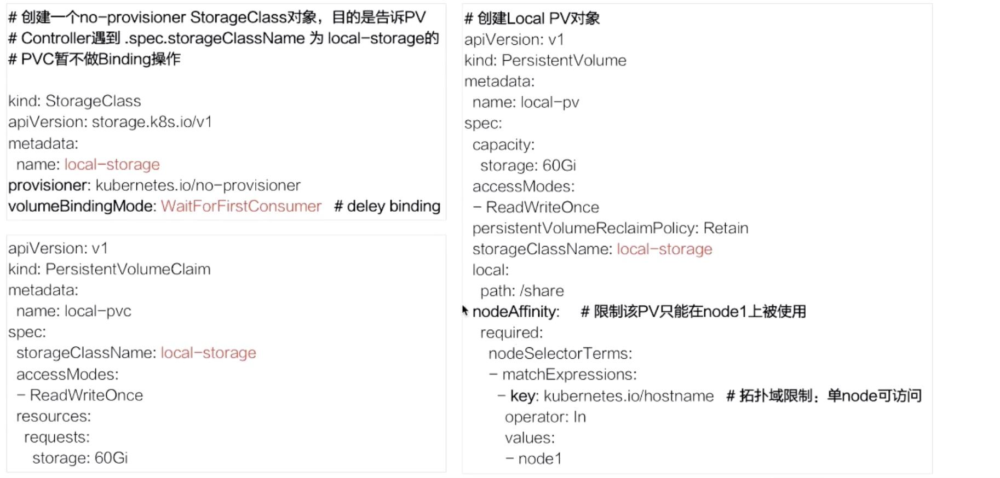
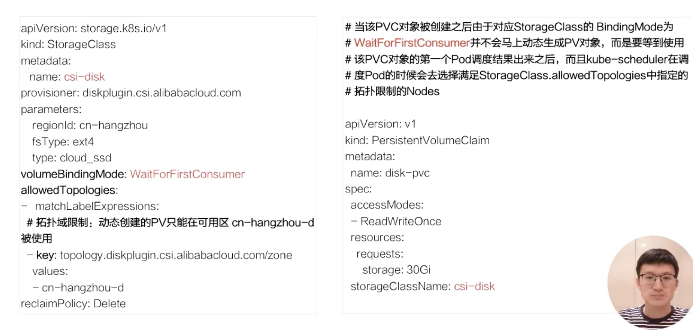
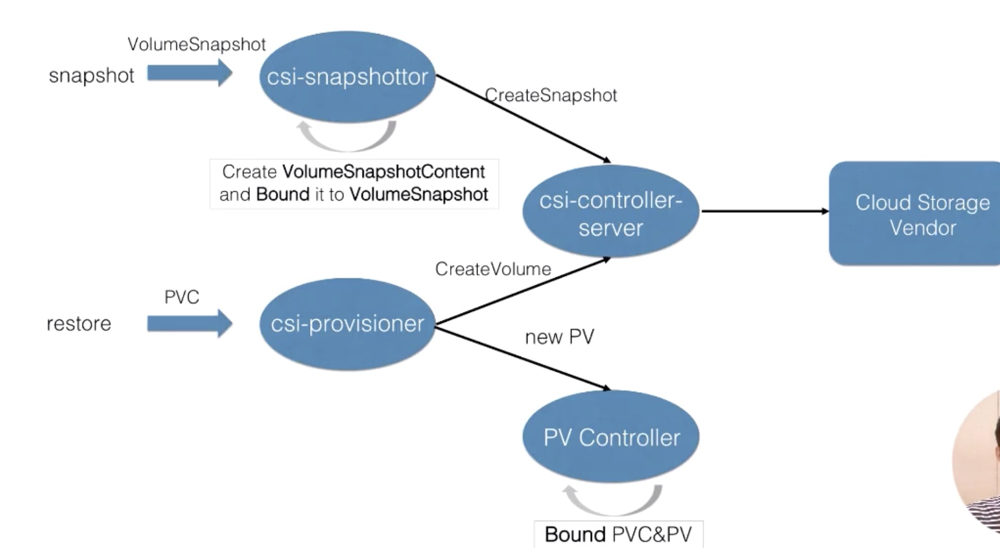
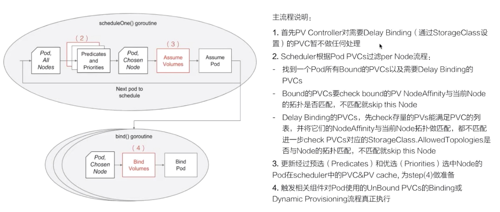

### Lec10:  应用存储和持久化数据卷：存储快照和拓扑调度

#### 1. 存储快照 

##### 1. 产生背景

1. 线上误操作，数据恢复能力
2. 线上数据迁移，如环境复制，数据开发

k8s csi snapshot controller 解决这一需求

snapshot controller 仿照 pvc(user) storagrclass pv 的设计思想，即 volumeSnapshot(user) VolumeSnapshotClass(cluster admin) VolumeSnapshotContent(dynamic provisioning)

##### 2. 用法

##### 在 pvc 中指定 .Spec.dataSource 字段指定 VolumeSnapshot 对象，生成 pv 对应的存储数据是从 VolumeSnapshot 关联的 VolumeSnapshotContent 中 restore 出来的


#### 2. 拓扑调度

##### 1. Topology 拓扑在 k8s 中的意思？

k8s 集群的 nodes 按照一定的规则划分正确的区域，并通过 label 设定属于自己的一个具体的拓扑位置；nodelabel 如：

1. Failure-domain.beta.kubernetes.io/region=>us-centre1#拓扑域为 region 的范围  云存储跨地域
2. Failure-domain.beta.kubernetes.io/zone=>us-centre1-a#拓扑域为 zone 的范围 标记 region 不同的可用 zone
3. kubernetes.io/hostname=> nodename #拓扑域为 node 的范围

也可以自定义 key ，如 rack (机架)


##### 2. 拓扑调度的产生背景

k8s 通过 pv 和 pvc 将存储与计算分离，通过设置 pv.Spec.nodeAffinity 设置访问限制，只有特定的 node 访问 PV . 这样会带来一个问题就是和 pod 的关联性调度，即 pod 使用了这个 pvc ，调度到某一节点，但是 PV 在该节点上不能访问，怎么办？

1. 场景1：Local PV（因为对于 IO 比较大，比如数据库或者 AI 中的训练操作，[linux IO  test](https://www.cnblogs.com/shengs/p/5019918.html) ） 只能在指定的 node 上被 pod 访问

   即 pod 被调度到 node1, 但是对应的 pvc 对应的是 node2 上的 local pv

2. 单个 Region 多 zone 集群，阿里云云盘只能被同一个 zone 的 node 的 pod  访问

##### 3. 存储调度的本质

1. 本质问题： PV 在绑定或者 dynamic provisioning 的时候，不知道 pod 被调度到哪个node, 但是 pv 访问本身对于 node 的拓扑有限制
2. 解决方法：将 pv  的 binding/Dynamic provisioning 操作放在 pod 被调度之后，好处：
   1. 对于 pre-provisioning 的含有 nodeaffinity 的  PV 对象（如 local PV ），可以在 Pod 确定绑定的 node 之后，根据node 找到合适的 pv 对象和 pod 的 pvc 对象进行绑定
   2. 对于 dynamic provisioning ，在  pod 确定调度  node，根据 node 的拓扑信息创建可被该node访问的 PV 对象
3. kubernetes controller 相对性的修改
   1. PV controller: 支持延时 binding
   2. Dynamic PV Provisioner, 动态创建PV 根据pod 运行时的node 的拓扑信息
   3. Scheduler：选择 node 时候需要考虑到 pod 的 PV binding 的需求，也就是需要结合 pre-provision 的 pod 的 node affinity 以及 dynamic provisioning 时PVC 指定storageClass.AllowedTopologies 的限制

#### 3. 样例

##### 1. volume snapshot 使用

1. 集群管理员创建

   ```yaml
   apiVersion: snapshot.storage.k8s.io/v1alphav1
   kind: VolumeSnapshotClass
   metadata:
     name: disk-snapshotclass
   snapshotter: diskplugin.csi.alibabacloud.com  # 指定 volume Snapshot 使用的 volume 插件
   ```

2. 用户创建

   ```yaml
   apiVersion: snapshot.storage.k8s.io/vaalphav1
   kind: VolumeSnapshot
   meta:
     name: disk-snapshot
   spec:
     snapshotClassName: disk-snapshotclass
     source:
       name: disk-pvc # snapshot 的数据源
       kind: PersistentVolumeClaim
   ```

   如何使用存储快照

   ```yaml
   apiVersion: v1
   kind: persistentVolumeClaim
   metadata:
     name: restorestorage
   spec:
     dataSource:
       name: disk-snapshot
       kind: VolumeSnapshot
       apiGroup: snapshot.storage.k8s.io/v1alphav1
     accessMode: 
     - ReadWriteOnce
     resource:
       request:
         storage: 20Gi
       storageClassName: csi-disk
   ```

##### 2. Local PV 拓扑示例

静态首先声明 PV 对象；目的： 告诉 PV controller 在遇到.spec.storageClassName 为 local-storage 的 PVC 不做binding 操作 	



为什么 local pv 指定了 storageClass, 是为了得到 storageClass 中的 volumeBindingMode 来达到延时绑定的目的 

##### 3. 限制 dynamic provisioning pv 拓扑示例



allowTopologies 字段，表明动态创建出来的 PV 必须是这个指定 key 区域可以访问的，因为声明延时访问，pod pvc 使用该 PV，保证 pod 的 node 是在这个可用区的


#### 4. 具体分析

##### 1. k8s volume snapshot 具体处理流程



Csi outoftree 方式实现存储（推荐）；

Csi-snapshotter、csi-provisioner 是 k8s 自己的 controller 

Csi-controller-server 是云存储厂商实现的 driver 部分（plugin）

流程：

1. 用户提交 volumesnapshot
2. Csi-snapshotter watch 到后通过grpc 调用csi-plugin ，然后通过 openapi 实现存储快照的动作
3. 生成存储快照后返回到 csi-snapshotter ，它会将 snapshot 中的相关信息放到 volumesnapshotcontent 中并将其与 用户提交的 volumesnapshot 对象做绑定
4. 声明 pvc 对象，csi-provisioner watch 到，通过 grpc 创建 Volume ,相对于上一节增加 snapshot 的 id ,到云储存厂商，多做一步：将存储快照恢复到创建的这块存储中，返回 csi-provisioner 后，将相关信息写到 PV 对象中，PV controller watch 到后和 PVC 绑定


##### 2. Volume Topology-aware 调度流程

