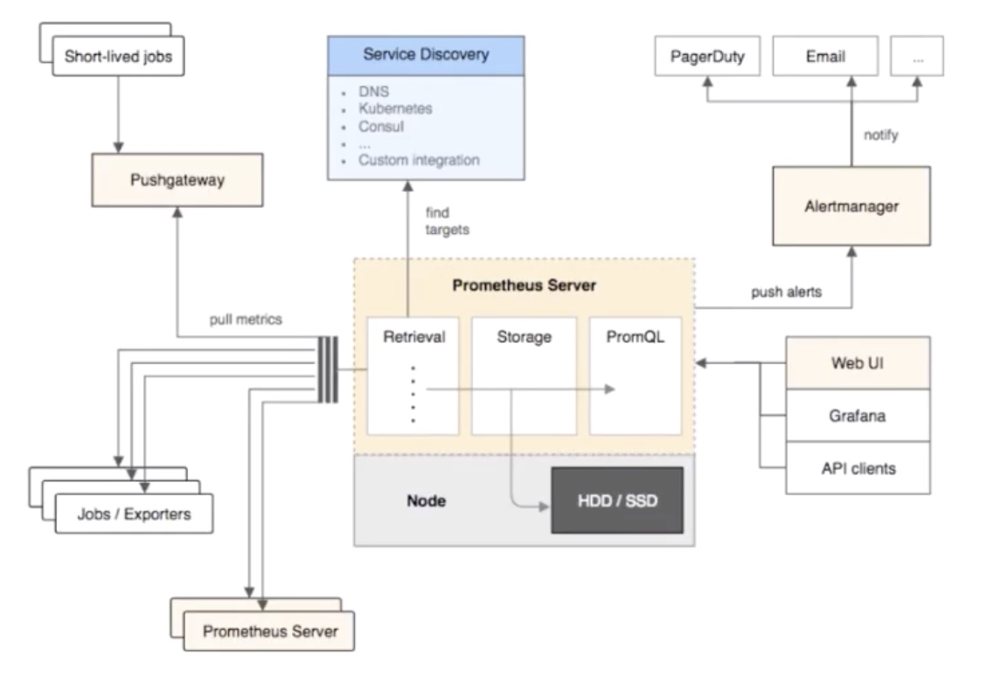
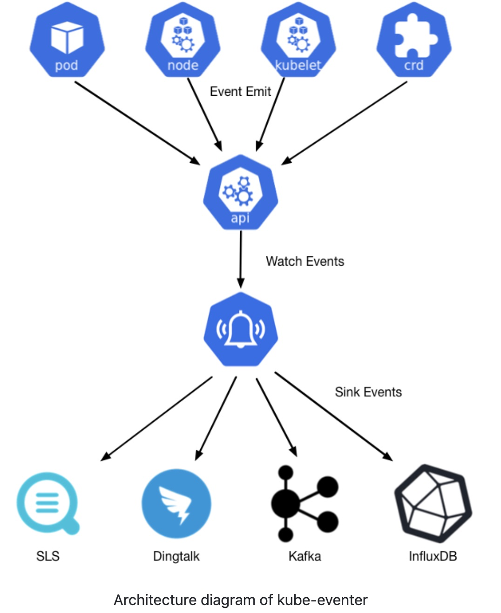
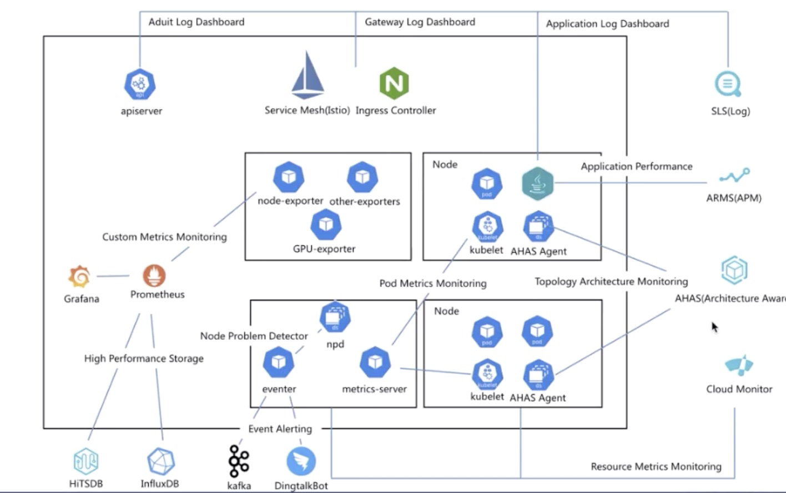
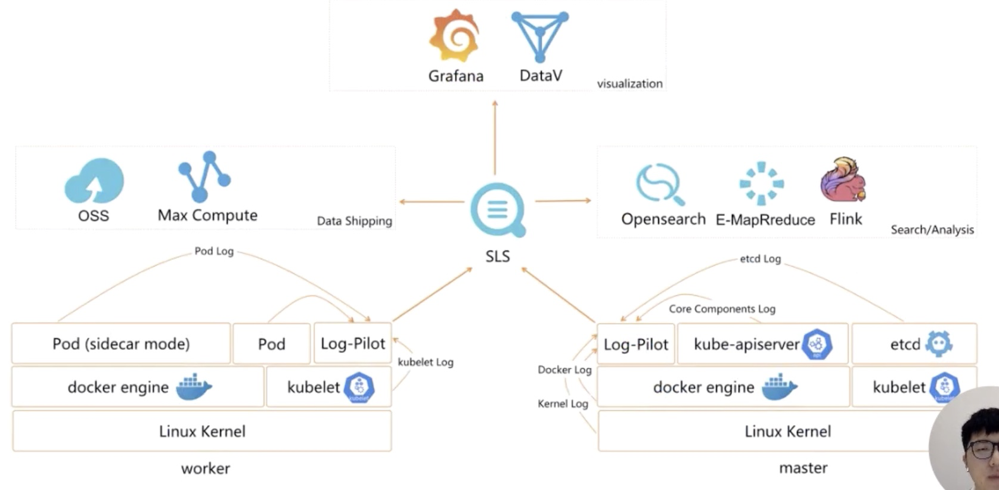

* [Lec12：可观测性——监控与日志](#lec12可观测性监控与日志)
   * [1. 需求](#1-需求)
      * [1. 监控](#1-监控)
   * [2. 方案](#2-方案)
      * [1.早期 Heapster](#1早期-heapster)
      * [2. Metrics-Server](#2-metrics-server)
      * [3. Prometheus](#3-prometheus)
      * [4. <a href="https://github.com/AliyunContainerService/kube-eventer">Kube-Event</a>](#4-kube-event)
   * [3. K8s 监控接口标准](#3-k8s-监控接口标准)
      * [1. Resource Metrics metrics.k8s.io 实现 metrics-server 提供资源监控](#1-resource-metrics-metricsk8sio-实现-metrics-server-提供资源监控)
      * [2. Custom Metrics custome.metrics.k8s.io 主要实现是 prometheus，提供资源监控和自定义监控（同样可以使用该接口进行 HPA）](#2-custom-metrics-customemetricsk8sio-主要实现是-prometheus提供资源监控和自定义监控同样可以使用该接口进行-hpa)
      * [3. External Metrics external.metrics.k8s.io 云厂商 Provider，通过云资源监控指标](#3-external-metrics-externalmetricsk8sio-云厂商-provider通过云资源监控指标)
   * [4. 日志](#4-日志)
      * [1. 日志的场景](#1-日志的场景)
      * [2. 日志的采集](#2-日志的采集)
   * [5. 阿里云容器监控体系](#5-阿里云容器监控体系)
      * [1. 四个服务：](#1-四个服务)
   * [6. 阿里云容器服务日志体系](#6-阿里云容器服务日志体系)

Created by [gh-md-toc](https://github.com/ekalinin/github-markdown-toc)

### Lec12：可观测性——监控与日志

#### 1. 需求

大型分布式系统维护系统的稳定性，需要监控和日志的收集；监控及日志不是 k8s 核心功能，但是有标准的接口

##### 1. 监控

1. 监控资源： CPU、内存、网络等
2. 性能监控：应用内部监控，通常以 hook 的机制在虚拟机的内部、字节码执行层执行隐式回调、或者在应用层显式的注入，常用来诊断和调优
3. 安全监控：例如越权管理，安全漏洞扫描
4. 事件监控：紧贴k8s设计理念，补充常规监控的弊端

#### 2. 方案

##### 1.早期 Heapster

Heapster 获取在 kubelet 上面做信息收集的 cadvisor, cadvisor 采集完成后会在 Kubelet 上将信息进行包裹成三种 api(summary、kubelet、promthemes)、heapster 支持 summary 和 kubelet 接口，heapster 会定期的拉取数据，然后自己进行聚合，暴露相应的 service供 消费者（dashboard、HPA controller 通过调用 service的数据实现弹性伸缩）使用

##### 2. Metrics-Server

转换成 metrics-server 的原因？

1. heapster 在做监控接口标准化（因为无法拓展资源，例如在线人数，GPU 使用量根据监控实现 HPA）

2. site 太多进行可视化，但是难以维护

目前 metrics-server 的架构简单：core、api、source(summary、manager)、api registry（应用可以根据这个接口获取信息）

##### 3. Prometheus



1. 三种数据采集方法：
   1. pushgateway 应用于短暂的任务；为了避免短任务时间少于prometheus更新的时间
   2. job expoter
   3. Prometheus server
2. 服务发现机制
   1. 静态配置
   2. 动态的通过例如 kubernetes（注解 annoation）、dns等
3. 报警方案 AlertManager
   1. 邮件、短信等
4. 消费
   1. Web UI
   2. Grafana
   3. Api Client

建议直接使用 [Promtheus Operator](https://github.com/coreos/prometheus-operator)

##### 4. [Kube-Event](https://github.com/AliyunContainerService/kube-eventer)



```yaml
apiVersion: apps/v1beta2
kind: Deployment
metadata:
  labels:
    name: kube-eventer
  name: kube-eventer
  namespace: kube-system
spec:
  replicas: 1
  selector:
    matchLabels:
      app: kube-eventer
  template:
    metadata:
      labels:
        app: kube-eventer
      annotations:	
        scheduler.alpha.kubernetes.io/critical-pod: ''
    spec:
      dnsPolicy: ClusterFirstWithHostNet
      serviceAccount: kube-eventer
      containers:
        - image: registry.cn-hangzhou.aliyuncs.com/acs/kube-eventer-amd64:v1.0.0-d9898e1-aliyun
          name: kube-eventer
          command:
            - "/kube-eventer"
            - "--source=kubernetes:https://kubernetes.default"
            ## .e.g,dingtalk sink demo
            - --sink=dingtalk:[your_webhook_url]&label=[your_cluster_id]&level=[Normal or Warning(default)]
          env:
          # If TZ is assigned, set the TZ value as the time zone
          - name: TZ
            value: America/New_York
          volumeMounts:
            - name: localtime
              mountPath: /etc/localtime
              readOnly: true
            - name: zoneinfo
              mountPath: /usr/share/zoneinfo
              readOnly: true
          resources:
            requests:
              cpu: 100m
              memory: 100Mi
            limits:
              cpu: 500m
              memory: 250Mi
      volumes:
        - name: localtime
          hostPath:
            path: /etc/localtime
        - name: zoneinfo
          hostPath:
            path: /usr/share/zoneinfo
---
apiVersion: rbac.authorization.k8s.io/v1
kind: ClusterRole
metadata:
  name: kube-eventer
rules:
  - apiGroups:
      - ""
    resources:
      - events
    verbs:
      - get
      - list
      - watch
---
apiVersion: rbac.authorization.k8s.io/v1
kind: ClusterRoleBinding
metadata:
  annotations:
  name: kube-eventer
roleRef:
  apiGroup: rbac.authorization.k8s.io
  kind: ClusterRole
  name: kube-eventer
subjects:
  - kind: ServiceAccount
    name: kube-eventer
    namespace: kube-system
---
apiVersion: v1
kind: ServiceAccount
metadata:
  name: kube-eventer
  namespace: kube-system
```


#### 3. K8s 监控接口标准

##### 1. Resource Metrics metrics.k8s.io 实现 metrics-server 提供资源监控

##### 2. Custom Metrics custome.metrics.k8s.io 主要实现是 prometheus，提供资源监控和自定义监控（同样可以使用该接口进行 HPA）

##### 3. External Metrics external.metrics.k8s.io 云厂商 Provider，通过云资源监控指标

#### 4. 日志

##### 1. 日志的场景

1. 主机内核的日志：网络栈异常、驱动异常、文件系统（例如 docker aufs）异常
2. Runtime 日志：最常见的是 docker ，查看docker 日志
3. 核心组件日志：apiserver 日志可以用来审计、scheduler 日志可以诊断调度、etcd 可以查看存储的状态、Ingress 日志可以分析接入层的流量
4. 应用部署日志： 分析应用业务层的状态、诊断异常

##### 2. 日志的采集

1. 从采集位置划分：宿主机文件（hostpath  volume 将日志保存在宿主机，通过logrotate logging-agent 进行数据采集）、容器内文件（通过一个 sidecar pod 转写到 std out）、容器标准/错误输出

2. 社区方案： Fluented 日志采集

   fluented client 搜集日志后聚合处理后传到 elasticsearch 或者 influxdb 中对应的前端是 kibana 和 grafana

#### 5. 阿里云容器监控体系



##### 1. 四个服务：

1. SLS 日志服务

   1. Apiserver 采集审计日志
   2. istio、ingress 采集到接入层日志
   3. 应用层日志

   除了链路的打通，同时需要可视化一些采集的信息，对于a例如做了哪些操作、有没有攻击、认证失败多少次等; 对于 b 例如统计 qps、连接数等；

2. ARMS 性能监控 目前支持 java 和 php 进行性能调优

3. AHAS 架构感知，拓扑可视化 微服务带来的组件过多难以排查，通过网络栈的监控绘制应用的拓扑关系、带宽监控、流量监控以及诊断

4. cloud monitor 

   1. Metrics 上进行增强，客户需求，版本兼容等
   2. eventer 组件以及 Node Problem Detector(kernel hang、出入网的监控、SNAT 检测、lb check等)
   3. Prometheus 生态：对接 HiTSDB、InfluxDB ，采集层提供优化的 node-expoter、场景话采集日志 (spark tensorflow)、GPU(单卡和 share)

#### 6. 阿里云容器服务日志体系



可以采集 本地、容器、应用的日志，可以进行数据离线到 OSS MAX computer等以及在线的 flink
