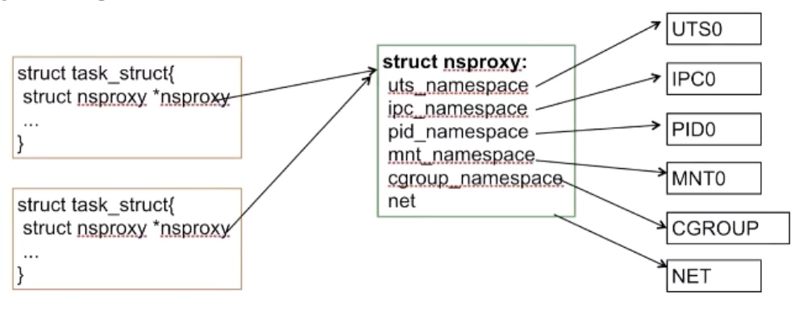
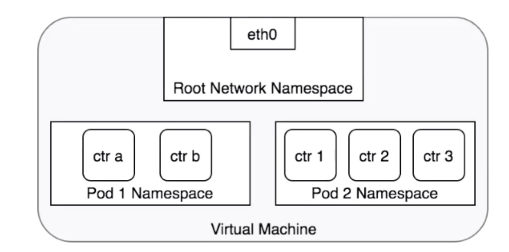
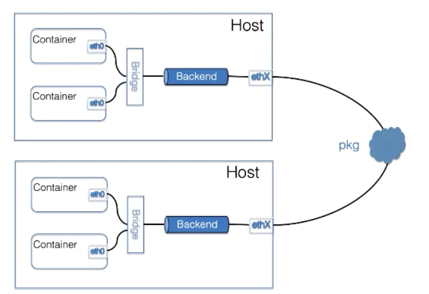

### Lec13: Kubernetes网络概念及策略控制

#### 1. K8s 网络的基本准则

##### 1. 三个基本条件

1. 所有 Pod 可以和其他 Pod 直接通信，无需显示的使用 NAT 
2. 所有的 Node 可以和 Pod 直接通信，无需显式的使用 NAT
3. Pod 可见 ip 确为其他 pod 连接使用 Ip ，无需转换

##### 2. 四大目标

1. 容器和容器通信
2. pod 和 pod 通信
3. pod 和 service 通信
4. 外部和 service 通信

#### 2. 容器网络的类型

社区坚持 一个 pod 一个 ip 摒弃端口配置，便于统一管理

##### 1. Underlay

其和 Host 网络同层，需要通过

##### 2. Overlay

Ip 不是 host 管理，不会出现 ip 冲突

#### 3. Net Namespace



Network Namespace 是实现容器网络隔离的基础

1. 拥有独立的附属网络设备(lo、veth等虚拟设备/物理设备)
2. 独立的协议栈、IP 地址和路由表
3. iptables 规则
4. ipvs 等

上面的 nsproxy 相当于运行环境



每一个 pod 拥有自己的 netns, pod 中的容器共享，内部可通过 lookback 接口通信，外部可以通过统一的 ip 进行连接， 宿主机的 netns pid 为1


#### 4. 容器网络实现

##### 1. 方案

1. Fannel backend 实现覆盖多个场景

   

   支持 overlay 和 underlay 场景，backend 可选择用户态（udp）内核 vxlan(性能好)，如集群不大处以同一个二层域可以选择 host-gw 

2. Calico 采用 BGP 实现网络直连，对底层网络有要求(MAC 地址 要求直通 )

3. Canal( flannel for network, Calico for firewall)

4. cilium 以 eBFP XDP 实现高性能 Overlay 实现

5. Kube-router 同样采用 BGP 提供网络直连，集成LVS 负载均衡的能力

6. Romana 采用 BGP or OSPF 提供网络直连的能力

7. WeaveNet 采用 UDP 封装实现 Overlay2 ，支持用户态（慢，可加密）/ 内核态（快，不可加密）

     

#### 5. Network Policy 概念

基于策略进行网络连通的管理，采用标签选择器模拟传统的分段网络，通过策略控制流量以及来自外部的流量

##### 1. 使用 Network Policy

1. apiserver 打开extensions/v1beta1/networkpolicies
2. 网络插件要支持，例如 flannel  romana weave net trireme

##### 2. 配置实例

通过 namesapceSelector 和 podSelector 控制流量

```yaml
apiVersion: networking.k8s.io/v1
kind: NetworkPolicy
metadata:
  name: test-network-policy
  namespace: default
spec:
  podSelector:
    matchLabel:
      role: db
    policyType:
    - Ingress
    - Egress
    ingress:
    - from: 
      - ipBlock:
        cidr: 172.17.0.0/16
        except:
        - 172.17.1.0/24
      - namespaceSelector:
        matchLabels:
          project: myproject
      - podSelector:
        matchLabels:
          role: frontend
      ports:
      - protocol: TCP
        port: 6379
      egress:
      - to:
        -  ipBlock: 
          cidr: 10.0.0.0/24
        ports:
          - protocol: TCP
            port: 6379
  
```

控制三件事情：

1. 通过 spec 的 selector 选择控制的对象
2. 控制流方向： Ingress from Egress to
3. 流的特征： 对端、ip 段、协议、端口

#### 6. 小结

1. Pod 在容器网络中的核心是 ip
2. 影响网络性能的关键是网络的拓扑，数据包端到端的传输
3. 牢记 Overlay/ UnderLay 网络选型，建议： 普适性最强 flannel-Vxlan、两层可直连 Calico/Flannel-host-gw
4. 使用 NetworkPolicy 实现流控制


#### 引用

- [linux 网络解析](https://www.cnblogs.com/yelongsan/p/8482129.html)