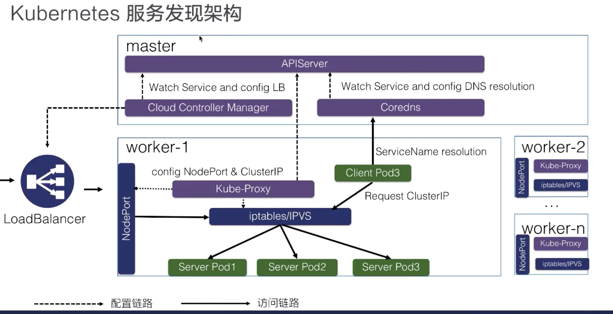

### Lec14: Kubernetes Service

#### 1. 需求来源

1. pod 的 ip 是会变化的（在销毁和重启的时候）
2. 对于应用来说，调用的入口一般是唯一的，需要负载均衡
3. 应用间在不同的部署环境上需要保持相同的部署拓扑和访问方式

外部网络和 pod 都可以通过 service 访问后端的 Pod 

#### 2. Service 语法

```yaml
apiVersion: v1
kind: Service
metadata:
  name: my-service
  labels:
    app: my-service
spec:
  selector:
    app: MyApp #pod 选择器
  ports:
  - protcol: TCP
    port: 80 # 负载均衡前端口
    targetPort: 9366 # pod ip
    
```

查看 service 信息主要有虚拟 ip 和 endpoints 

#### 3. 如何访问 Service

##### 1. 有头 Service

1. 虚拟Ip: 前端口

2. serviceName:前端口

3. k8s pod 中会预先打入一些环境变量

   MY_SERVICE_SERVICE_HOST

   MY_SERVICE_SERVICE_PORT

   ...

##### 2. Headless Service

容器中的 pod 以及集群内可以直接通过 ServiceName:targetPort 访问

```yaml
apiVersion: v1
kind: Service
metadata:
  name: my-service
  labels:
    app: my-service
spec:
  selector:
    app: MyApp #pod 选择器
  clusterIp: None # 没有 vip
  ports:
  - protcol: TCP
    port: 80 # 负载均衡前端口
    targetPort: 9366 # pod ip
```

#### 4. 集群外部如何访问 Service

##### 1. NodePort

在集群的 Node 上开一个端口32xxx 转发 ClusterIP:port 端口的流量 再到 podip:targetPort

##### 2. NodeBalancer

NodeBalancer 相当于在 NodePort 前面再挂一个负载均衡，Ali SLB 

#### 5. K8s Service 整体架构



​	

