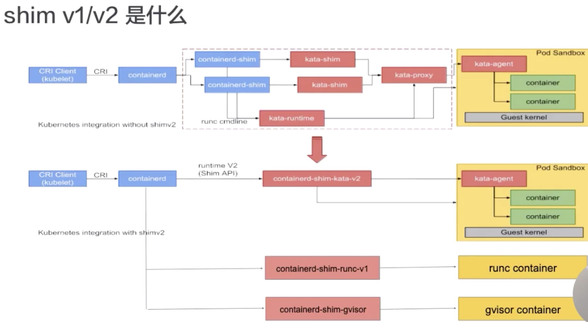
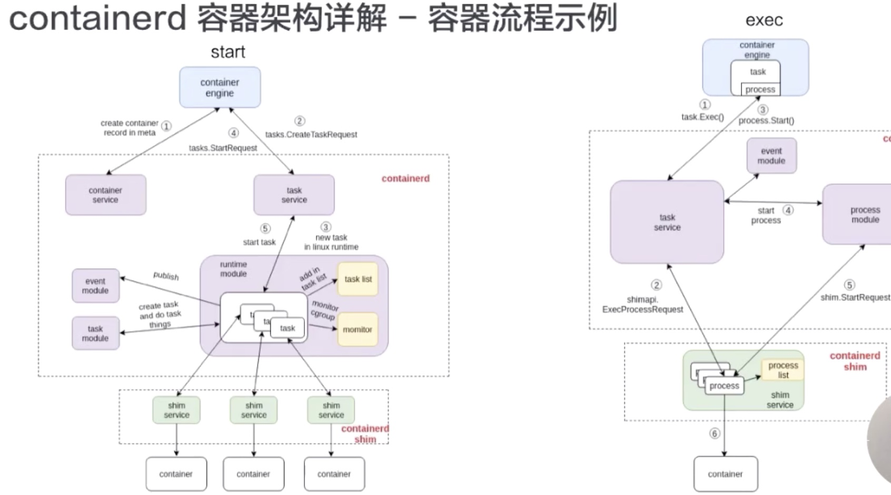

### Lec15: 深入剖析Linux 容器

#### 1. 容器

##### 1. 容器相对于虚拟机

容器相对于虚拟机少了 Hypervisor 层, 在 docker 中 docker daemon 取代之；注意不能简单的说容器和虚拟机在 HostOS 层有区别而是 Guest OS，因为虚拟机的 hyper-kit、Hyper-V、kvm 也不需要 HostOS层，但是 VirtulBox 和 VM 需要

以 docker 容器 engine 介绍：容器 = namespace + cgroup + docker image；如何在创建容器进程的时候保证该进程所使用的资源是被隔离和限制住的

#### 2. 资源隔离和限制

##### 1. 什么是 namespace?namespace 是干什么的？

namespace 是 Linux 内核中对于资源进行隔离的，对进程的资源进行隔离。

namespace 目前实现以下7项资源隔离：

通过 `ls -l /proc/$$/ns ` 查看 namespace 隔离

1. mount 挂载文件系统 保证容器的文件视图是镜像的，而不是宿主机的，bind 的除外

2. UTS  主机名和域名

3. pid 进程号， 保证 init 进程的 pid 是 1

4. network 网络设备、网络栈、端口

5. user 用户和用户组 uid、gid 注意内核在3.8才有

6. ipc 信号量、消息队列、共享内存；进程间通信

7. Cgroup 没有直接在 docker 中实现，但是在 docker Runc 中实现

   查看 cgroup: `cat /proc/self/cgroup` 内核4.6才有 ；对进程进行分组，在对分组整体进行资源的分配和控制

##### 2. 如何创建 namespace

1. 命令行

   ```bash
   $ unshare --fork --pid --mount-proc selflink /proc/self
   1
   $ unshare --map-root-user --user sh -c whoami
   root
   $ touch /root/uts-ns
   $ unshare --uts=/root/uts-ns hostname FOO
   $ unshare --uts=/root/uts-ns hostname
   FOO
   $ unshare --mount-proc --fork --pid /bin/bash
   $ ps -a
   ```

2. 代码实现

##### 3. Cgroup 详解

cgroup 是对进程进行分组，对于分组的整体进行资源的限制个隔离；

1. 层级

   cgroup 是分层的树形结构，根节点是 root group 即系统组，每一个节点是一个组，子节点继承父节点属性;

2. 子系统

   每一个子系统是一个资源控制器（常用）

   1. cpu 子系统，该子系统为每一个进程设置 cpu 使用的权重
   2. cpuset 子系统，在多核 cpu，该子系统可以设置进程组在此上面运行、并可以设置指定节点内存使用量
   3. Cpuacct 子系统，生成该进程组对于 cpu 的使用情况
   4. memory 子系统，提供以页面为单位的内存访问，可对进程组的内存上限设定，还可以生成使用报告
   5. Blkio 子系统，控制每一个块设备的输入和输出，通过设置进程组权重控制块设备对其 io 的时间，也可以限制 io 带宽和 iops、bps 速度限制；注意 blkio 只能限制同步 io 不能限制 Bufferedio
   6. device 子系统 ，该子系统可以控制进程组对于设备的访问
   7. freezer 子系统，可以使进程组所有进程挂起；比如容器中会调用之防止进程执行 fork 操作，防止进程侵入宿主机
   8. net-cls 子系统，对网络带宽进行限制，控制进程发送带宽和接受带宽
   9. 容器中 cgroup 还有一个 Pid： 限制容器中 pid 个数限制

docker  cgroup 驱动类型：

1. systemd cgroup driver

   写 cgroup 都需要通过 systemd 的接口完成，不能手动更改 cgroup 文件

2. Cgroupfs cgroup driver

   直接将 pid 写入 cgroup 文件，对对应的资源限制 memory_cgroup、cpu_cgroup 写入文件

   目前 kubelet 默认是 cgroupfs cgroup driver, 详见参考 runc 源码之 cgroup

注意 docker 支持 cgroup: 

Runc 除了支持 docker 支持的所有的 cgroup 还支持 net_cls、net_prio（设置进程的网络流量优先级）、hugetlb（设置 HugeTLB 使用）、perf_event（允许Perf工具基于Cgroup分组做性能监测）

还有一个 cgroup 都不支持：rdma

#### 2. docker image

三大部分： 1. 联合文件系统，即不同位置的文件在统一的视图下可见 2. 不同层可以被其他镜像复用 2. 最上层为容器层，是可读写层，可以通过 commit 变成只读层

详见 [docker driver 分析](https://github.com/xieydd/k8s-research/blob/master/docker/Storage-drive.md)

#### 3. Containerd 容器引擎

##### 1. 架构


containerd 是通过 grpc server 对于上层提供服务的；metrics 提供 cgroups 的一些信息采集


##### 2. Runtime

runtime 可能是 runc 或者 kata 等



流程：CRI  client（一般是 kubelet）通过 cri 请求 containerd, containerd-shim 去管理容器生命周期（对 Io 转发，对信号进行传递），kata 为了安全进行另外一层的拓展，这两步可以通过 containerd-shim-v2 一步完成



start 流程: engine 可能是 docker 或是 postman 等，contatiner 是containerd-shim 操作 RunC 命令创建的；meta data 创建容器服务 -》创建一个创建容器请求-》创建 runtime-》启动请求-》启动任我游 containerd 和 shim 是通过 grpc 进行交互 

exec 流程：和 start 不同，containerd 会处理，exec 会将进程加入已有的 namespaces 中


#### 参考

- [RunC 源码通读指南之 NameSpace](http://hutao.tech/k8s-source-code-analysis/around/runc/namespace.html)
- [kernel cgroup doc](https://www.kernel.org/doc/Documentation/cgroup-v1/cgroups.txt)
- [linux io 隔离](https://segmentfault.com/a/1190000016355300)
- [cgroup 解析](https://segmentfault.com/a/1190000016355300)
- [runc 源码之 cgroup](http://hutao.tech/k8s-source-code-analysis/around/runc/cgroup.html)
- [containerd 详解](https://www.cnblogs.com/sparkdev/p/9063042.html)