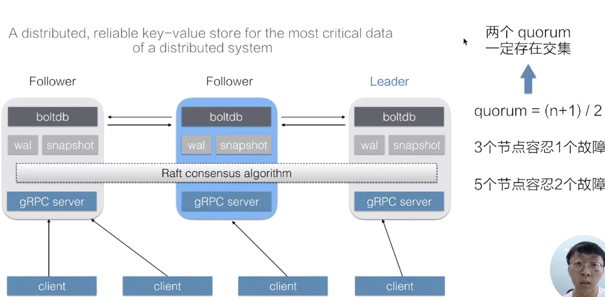
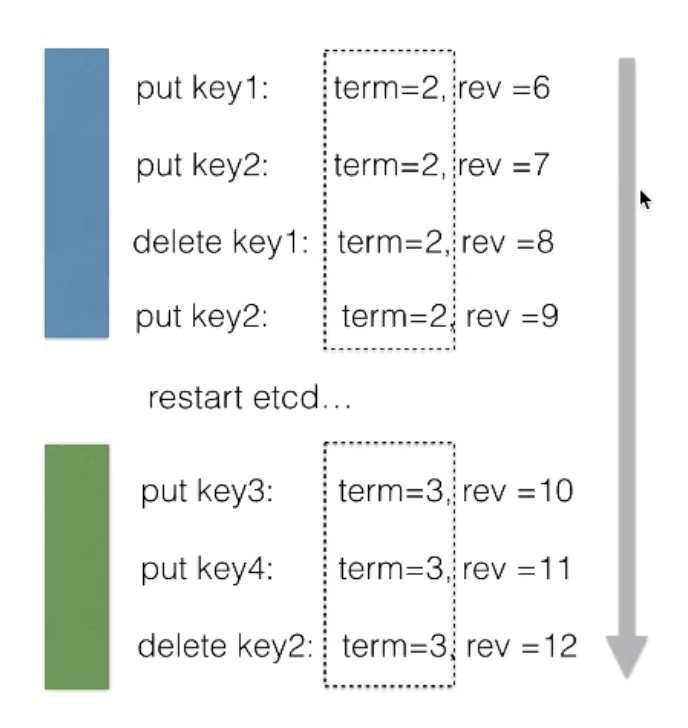
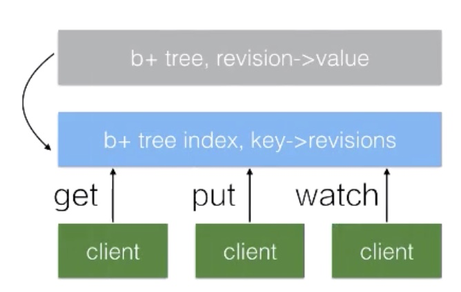
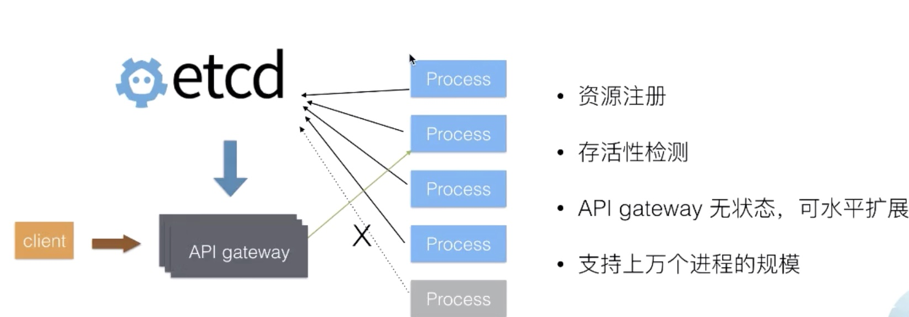

* [Lec16：深入理解 ETCD之基本原理解析](#lec16深入理解-etcd之基本原理解析)
   * [1. 架构和内部机制解析](#1-架构和内部机制解析)
      * [1. ETCD 的接口](#1-etcd-的接口)
      * [2. Etcd 数据版本号机制](#2-etcd-数据版本号机制)
      * [3. Etcd mvcc &amp; stream watch](#3-etcd-mvcc--stream-watch)
      * [4. Mini-Trainsaction 机制](#4-mini-trainsaction-机制)
      * [5. Lease 的概念和用法， 租约机制](#5-lease-的概念和用法-租约机制)
   * [2. 典型场景介绍](#2-典型场景介绍)
      * [1. Kubernetes](#1-kubernetes)
      * [2. Service Discovery(Naming Service)](#2-service-discoverynaming-service)
      * [3. 分布式选举](#3-分布式选举)
      * [4. 分布式并发控制](#4-分布式并发控制)

Created by [gh-md-toc](https://github.com/ekalinin/github-markdown-toc)

### Lec16：深入理解 ETCD之基本原理解析

####  1. 架构和内部机制解析

定义：分布式可靠的 Key-value 存储



Raft Consensus algorithm:  只要有一个 quorum 存活，其中一定存在某一个节点存在集群中的最新数据，这保证最终数据保持一致

可以通过 watch 查看 etcd 中的增量更新

##### 1. ETCD 的接口

1. PUT(key, value), Delete(key)
2. Get(key), Get(keyFrom, keyEnd)
3. Watch(Key/Keyprefix)
4. Transitions(if/then/else ops).Commit() 执行事务
5. Leases: Grant/Revoke/KeepAlive 分布式系统中常用的设计模式

##### 2. Etcd 数据版本号机制



1. term: 全局单调递增 64bits leader 切换的时候 term 会加一
2. revision: 全局单调递增  64bits 全局数据发生变更：包括创建、修改、删除的时候都变成当前操作的 revision，是 etcd 支持 mvcc 和数据的 watch
3. KeyValue:
   - create_revision 创建是操作对应的版本号
   - mod_revision 数据被修改的时候操作对应的版本号
   - version: 计数器，key value 被修改了多少次

##### 3. Etcd mvcc & stream watch

```
Put(Key, value1) rev=5
Put(Key, value2) rev=6
Get(Key) -> value2
Get(Key, rev=5) -> value1
```

指定版本 watch

```
watch = Watch(Key, rev)
for {
	event = watch.Recv()
	handle(event)
	...
}
```



在 etcd 中所有的数据存在这个 b+ 树中存在磁盘中通过map 的方式映射到内存以加速；灰色部分维护 revision 到 value 的映射关系，当通过revision 查询value 的时候可以通过该树直接返回；watch 的时候可以通过该映射关系，通过制定revision 遍历 b+ 树达到数据更新；蓝色部分维护 key 到 revision 的映射关系，通过key -> revision -> value ;会定期的Compation 清理历史数据

##### 4. Mini-Trainsaction 机制

```
Txn.if(
	Compare(Value(key1),">","bar"),
	Compare(Version(key1),"=","2"), # 视图一致
	...
).Then(
	Put(key2, valueX), #原子性
	Delete(key3)...
).Else(
	Put(key2, valueY)...
).Commit()
```

##### 5. Lease 的概念和用法， 租约机制

```
lease = CreateLease(10s) #创建 10s 的租约
Put(key1, value1, lease) # 当租期到期会自动清理 key1 的数据，同一个 lease 可以绑定多个 key
lease.KeepAlive() # 租约保持
lease.Revoke() #到期

```

#### 2. 典型场景介绍

##### 1. Kubernetes

/ns/pods /minions /configmaps /secrets

- 元数据高可用，无单点故障
- 系统无状态，故障修复简单
- 系统可水平拓展，提高性能和容量
- 简化架构实现，降低系统工程复杂度

##### 2. Service Discovery(Naming Service)



进程启动后将地址自注册到 etcd 中，从而使得 api 网关通过 etcd 感知到后端进程的地址，当后端进程故障迁移时，地址更新到 etcd ,api 网关随之可以发现最新的进程，还可以通过感知状态流量迁移；这样  api 网关也是无状态的可以水平拓展

##### 3. 分布式选举

对于 master-slaves 架构，都可以通过etcd 选举 master 从而保证高可用

##### 4. 分布式并发控制

进程存活性检测机制，当进程未执行完死掉，换下一个进程执行，存储进程执行状态


