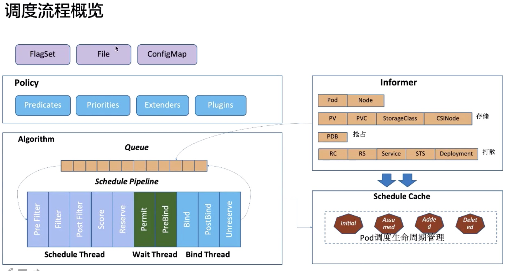
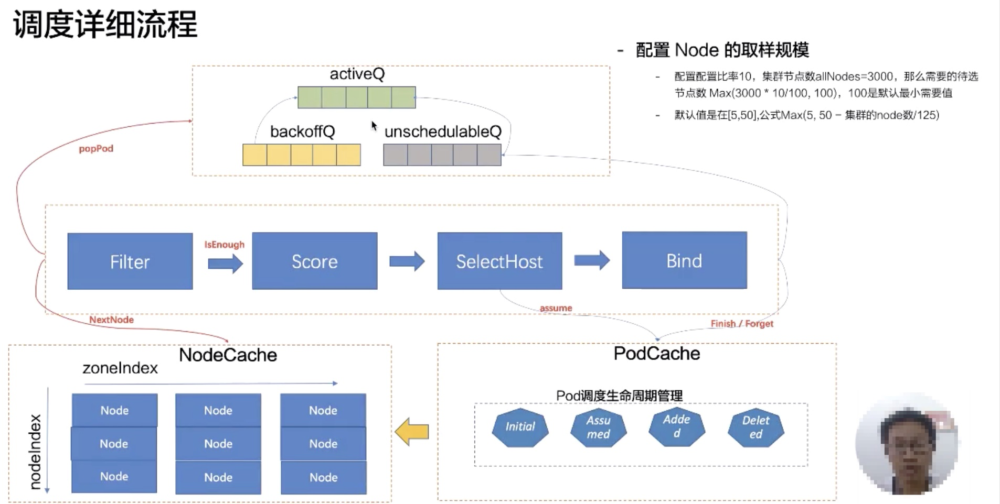
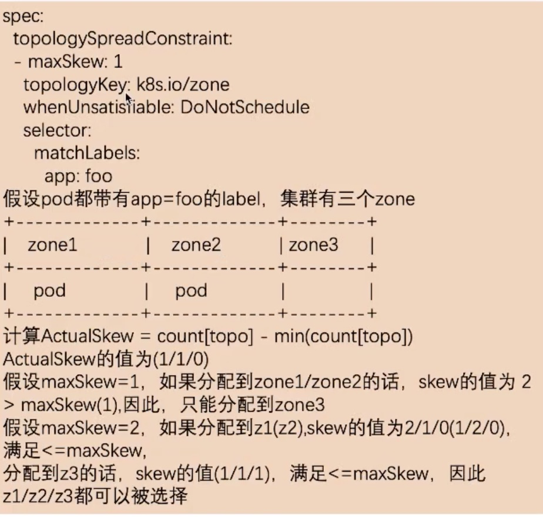
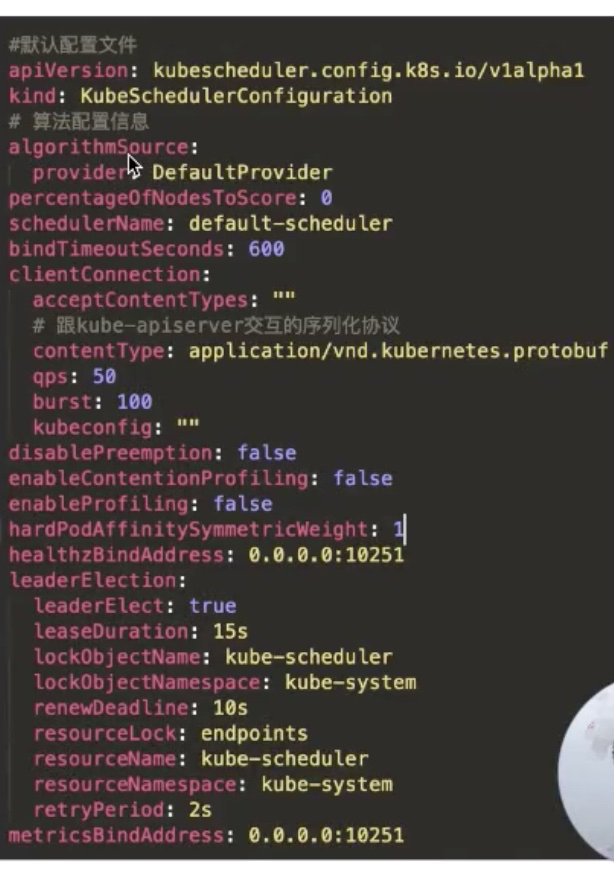
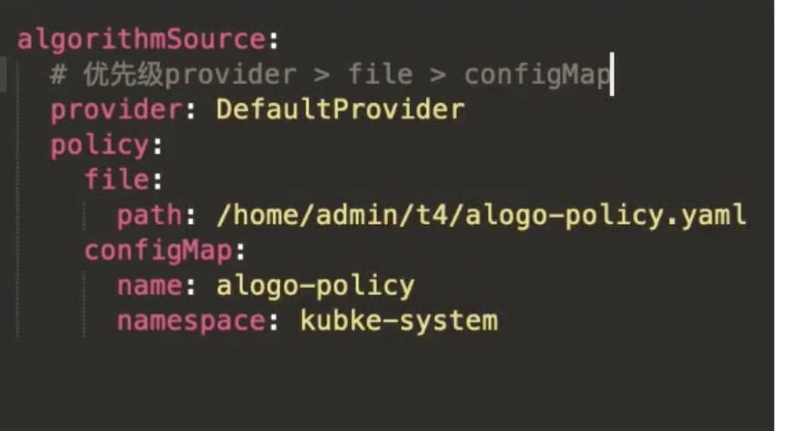
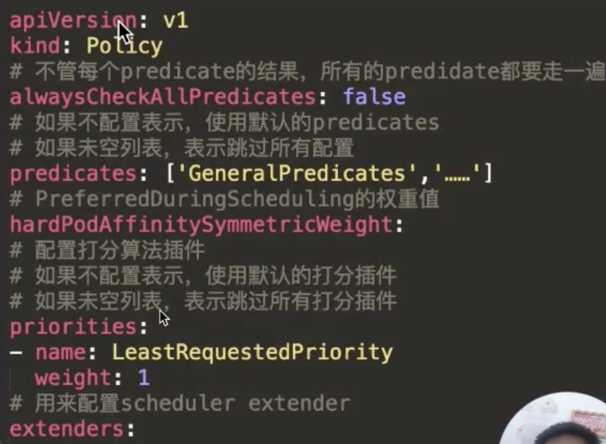
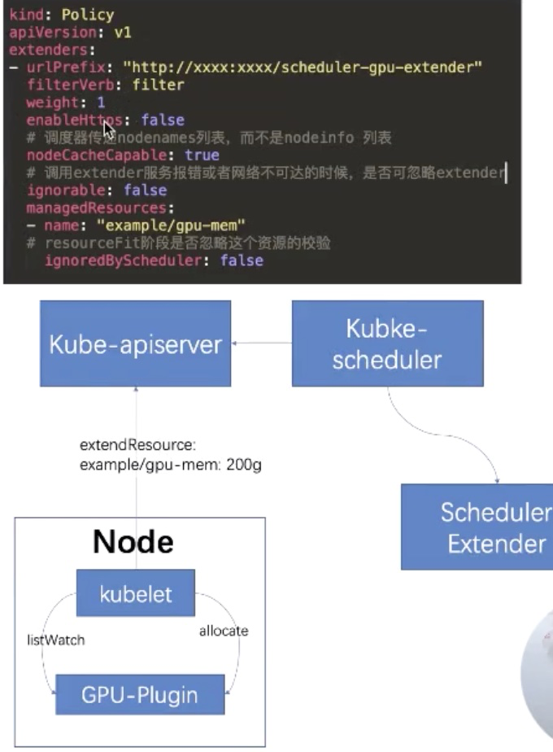
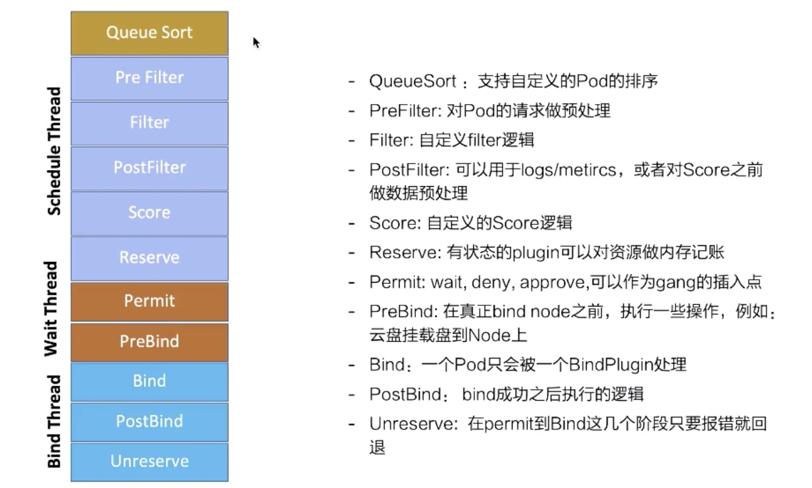
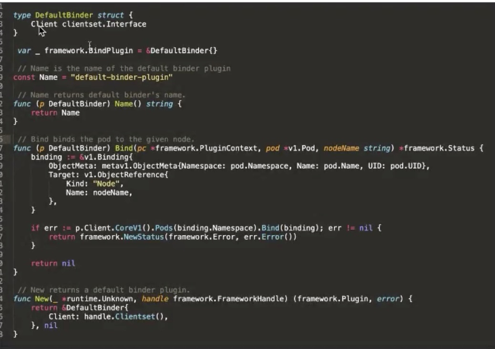
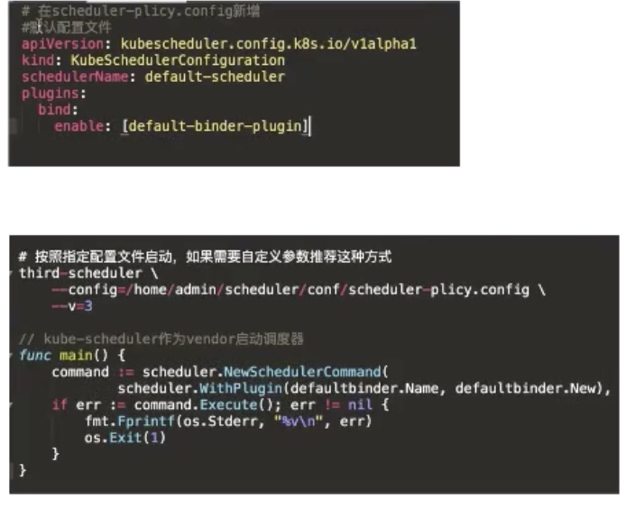

* [Lec19: 调度器调度流程和算法](#lec19-调度器调度流程和算法)
   * [1. 调度流程](#1-调度流程)
      * [1. 调度流程](#1-调度流程-1)
      * [2. 调度详细流程](#2-调度详细流程)
   * [2. 调度器算法实现](#2-调度器算法实现)
      * [1. Predicate 过滤器](#1-predicate-过滤器)
      * [2. Priorities 打分机制](#2-priorities-打分机制)
      * [3. 打分器之 pod 打散](#3-打分器之-pod-打散)
      * [4. Node 的亲和和反亲和](#4-node-的亲和和反亲和)
      * [5. Pod 的亲和和反亲和](#5-pod-的亲和和反亲和)
   * [3. 如何设置调度器](#3-如何设置调度器)
      * [1. 配置文件解释](#1-配置文件解释)
   * [4. 如何拓展调度器](#4-如何拓展调度器)
      * [1. Scheduler Extender:](#1-scheduler-extender)
      * [2. Scheduler Framework](#2-scheduler-framework)

Created by [gh-md-toc](https://github.com/ekalinin/github-markdown-toc)

### Lec19: 调度器调度流程和算法

#### 1. 调度流程

##### 1. 调度流程



1. 通过读取命令行参数或者 configmap 或者配置文件，读取调度策略
2. 指定使用哪些过滤器、打分器、外部拓展调度器、或者 scheduler plugin
3. 通过 Informer 机制，将调度器需要的资源 pod、Node 以及和 pod 相关资源 PV、PVC、StorageClass、CSINode、PDB 数据，打散 workload 数据：RC、RS、Service、STS、Deployment等

##### 2. 调度详细流程



1. 三个 Queue、activeQ、backoffQ、unschedulerQ，首先从 activeQ popPod;并且从 NodeCache 拿到相关 node 的数据（注意这里使用的是采样的算法，只拿部分集群节点（可配置））通过 zoneIndex 和 NodeIndex 组成矩阵，记录选择次数，保证 node 足够分散
2. 如果过滤器获得节点以及满足会结束调度、如果不满足，继续打分机制，然后进行预选择 podCache 中修改成 Assume,在 bind 之后还是这个状态，只有当 informer watch 这个 pod 的已经 Bind 后才会编程 Added
3. 如果 bind 失败的话，会重新丢到 unschedulerQ 中 30s
4. 当在整个调度周期中，Cache 发生变化时，pod 会被放到 backoffQ 中，backoffQ 会有一个降级策略，2^n 时间（1，2，4，8 ……s）最大10s

#### 2. 调度器算法实现

##### 1. Predicate 过滤器

1. 存储相关：

   1. NoVolumeZoneConflict 校验 pvc 上要求的 zone 是否和 node 的zone 匹配
   2. MaxCSIVolumeCountPred: Node 对单机挂载盘数量有限，会校验 pvc 指定 Provision 在 CSI Plugin 上报单机最大挂载盘数
   3. CheckVolumeBindingPred： pvc 和 pv 绑定逻辑校验
   4. NoDiskConflict : SCCI 存储不会被重复 volume

2. Pod 和 Node 匹配相关

   1. CheckNodeCondition: 校验 Node conditionType 是否 ready
   2. CheckNodeUnschedulable: Node UnScheduler 标签
   3. PodTolerationsNodeTaints: Pod 上的 toleration 和 node 上的 taint 匹配
   4. PodFitsHost: hostname 的校验
   5. MatchNodeSelector: 

3. Pod 和 Pod 相关

   1. MatchInterPodAffinity: 也就是 PodAffinityh 和 PodAntiAffinity 

4. Pod 打散相关

   1. EvenPodsSpread 

      1. Spec 描述一组 pod 在指定 TOPO 上打散要求

         ```yaml
         spec:
           # 多个之间是 and 关系
           topologySpreadConstraint：
           # maxSkew 最大允许不均衡的数量
           - maxSkew: 1
           topologyKey: k8s.io/zone
           # ScheduleAnyway DoNotSchedule
           # 当不满足 maxSkew 的策略
           whenUnsatisfiable: DoNotSchedule
           # 选择一组符合描述的 Pod
           selector:
             matchLabels:
               app: foo
             matchExpressions:
             - key: app
               operator: In
               values: ["foo", "foo2"]
         ```

         

         

   2. CheckServiceAffinity

##### 2. Priorities 打分机制

1. 资源水位
   1. LeastRequestedPriority: 优先打散 
   2. MostRequestedPriority: 优先堆叠
   3. BalancedResourceAllocation: 碎片率
   4. RequestedToCapacityRatioPriority: 指定比率的分数

2. 资源水位公式： request 表示 node 上已经分配的资源 Allocatable Node上可调度的资源

3. 优先打散： （Allocatable - Request）/Allocatable * Score 分配资源后资源最大率，优先分配到这个节点

4. 优先堆叠： Request/Allocatable * score 请求的越多优先考虑

5. 碎片率： {1 - Abs(CPU(Request / Allocated) - (Mem{Request/Allocated}))} * socre 越大，碎片率越大，优先不分配到这个节点

6. 指定比例，使用该选项当设定的比例达到 Request/Allocatable * MaxUtlization 时

    

##### 3. 打分器之 pod 打散

1. 解决问题： 支持符合条件的一组 pod 在不同的拓扑上部署的 spread 需求
2. selectorSpreadPriority:  获取和 pod 相同 controller 的所有 Pod , (sum - 符合 selector  pod 数量 )/sum 
3. serviceSpreadingPriority:  替换上面的 selectorSpreadPriority ，满足服务的打散分配
4. EvenPodsSpreadPriority: spec 指定 topology key , topopod = 满足 spec labelSlector ，算分按照 Node 级别累积， MaxDif = Total - Min(Node)  (Total - Node)/MaxDif

##### 4. Node 的亲和和反亲和

1. NodeAffinityPriority:
2. ServiceAntiAffinity: 支持 service 下的 pod 的分布按照 Node 的某个 label 的值进行均衡
3. NodeLabelPrioritizer: 支持优先分配到带或者不带某个 Label 的 node
4. ImageLocalityPriority: 镜像亲和调度；优先调度到有该镜像的节点

##### 5. Pod 的亲和和反亲和

1. InterPodAffinityPriority: 
   1. 如果应用A 提供数据，应用 B 提供服务，如果 A和 B 部署到一块的时候可以走本地网络，优化网络传输
   2. 如果应用 A  和 应用 B 都是 CPU 密集型，可能会相互干扰，故将两者隔离
2. NodePreferAvoidPodsPriority
   1. 针对 RC （Replicas Controller）和 RS (Replicas Set ) 在Node 对那些做亲和和反亲和

#### 3. 如何设置调度器

```bash
# 默认配置启动
kube-scheduler \
	--kubeconfig=~/.kube/config -v 3
	
# 指定配置文件启动
kube-scheduler \
	--config=~/scheduler-policy.config -v 3
```

##### 1. 配置文件解释



1. schedulerName: pod 调度器

2. algorithmSource: 算法提供来源

   

   三种来源 Provider(DefaultProvider、 ClusterAutoScalerProvider) file configmap

   策略： 

   AlwaysCheckAllPredicates 设定为 True 就是不管每一步过滤结果，每一个都要走

3. BindTimeoutSeconds: bingding 阶段超时时间

4. PercentpercentageOfNodesToScore: fliter 到的节点数和总的节点数比例达到这个数值时退出 fliter 


#### 4. 如何拓展调度器

##### 1. Scheduler Extender:



可以做什么：

1. 不改变原有调度器代码，直接在调度外起调度作用，类似 webhook
2. 支持 predicate、preempt、priority、bind 的注入
3. 一种ExtendResource Bind 只能一个 extender

##### 2. Scheduler Framework



1. 如何自定义 Plugin

   

2. 如何启动自定义 Plugin

   

   
