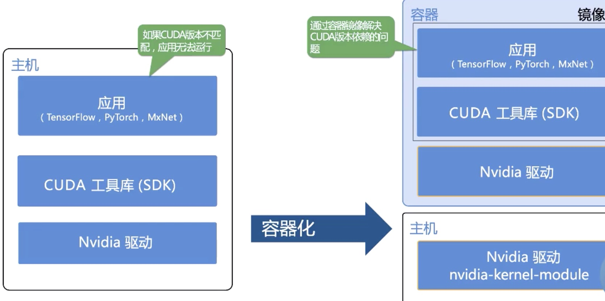
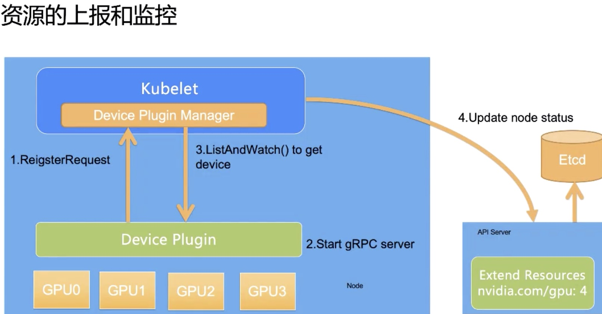
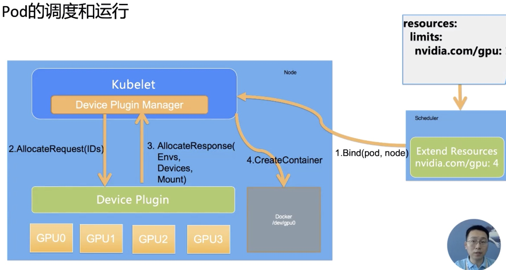

* [Lec20: GPU 管理和 Device Plugin 机制](#lec20-gpu-管理和-device-plugin-机制)
   * [1. 需求来源](#1-需求来源)
      * [1. 为什么使用 Kubernetes 管理 GPU 这种异构设备？](#1-为什么使用-kubernetes-管理-gpu-这种异构设备)
   * [2. GPU 的容器化](#2-gpu-的容器化)
      * [1. 如何在容器中使用 GPU](#1-如何在容器中使用-gpu)
   * [3. K8s GPU 管理](#3-k8s-gpu-管理)
      * [1. 如何部署 GPU kubernetes](#1-如何部署-gpu-kubernetes)
   * [4. 工作原理](#4-工作原理)
      * [1. Extended Resource](#1-extended-resource)
      * [2. Device Plugin Framework](#2-device-plugin-framework)
   * [5. Device Plugin 的工作机制](#5-device-plugin-的工作机制)
      * [1. 资源的上报和监控](#1-资源的上报和监控)
      * [2. pod 的调度和运行](#2-pod-的调度和运行)
   * [6. 缺陷](#6-缺陷)

Created by [gh-md-toc](https://github.com/ekalinin/github-markdown-toc)

### Lec20: GPU 管理和 Device Plugin 机制

#### 1. 需求来源

##### 1. 为什么使用 Kubernetes 管理 GPU 这种异构设备？

1. 加速部署，容器部署避免重复的机器学习复杂环境部署
2. 提升集群资源利用率，统一的调度和分配集群资源
3. 保障资源的独享：利用容器隔离异构设备，避免互相影响

#### 2. GPU 的容器化

##### 1. 如何在容器中使用 GPU

1. 构建支持 GPU 的容器镜像
2. 利用 docker 运行该镜像，并将设备和 GPU 运行库映射到容器中



k8s 将不会依赖于 cuda 版本而是驱动版本，避免了机器学习框架对于 cuda 版本依赖影响 k8s 调度、其中 nvidia 驱动和 内核绑定

使用docker 运行GPU 程序：

```shell
$ docker run -it \
--volume=nvidia_driver_xxx.xx:/local/nvidia:ro \
--device=/dev/nvidiactl \
--device=/dev/nvidia-uvm \
--device=/dev/nvidia-uvm-tools \
--device=/dev/nvidia0 \
nvidia/cuda nvidia-smi
```

Nvidia-docker 将自动做一些映射操作

#### 3. K8s GPU 管理

##### 1. 如何部署 GPU kubernetes

1. 安装 GPU 驱动

   ```bash
   $ sudo yum install -y gcc kernel-devel-$(uname -r)
   $ sudo /bin/sh ./NVIDIA-Linux-x86_64*.run
   ```

2. 安装 nvidia-docker2

   ```bash
   $ sudo yum install nvidia-docker2
   $ sudo pkill -SIGHUP dockerd
   ```

3. 部署 nvidia-device-plugin

   ```bash
   $ kubectl create -f nvidia-device-plugin.yaml
   $ kubectl get po -l component=nvidia-device-plugin
   ```

用户使用只需要 `spec.contaiiners.resource.limits.nvidia.com/gpu: 1` 即可

#### 4. 工作原理

##### 1. Extended Resource

自定义资源， 允许用户分配和使用non-kubernetes-built-in 的计算资源（RDMA、AMD-GPU、FPGA ），以统一的视角管理资源

被申请完后会执行上报操作：

```bash
# 执行 Patch 操作
$ curl --header "Content-Type:application/json-path+json" \
--request PATCH \
--data '[{"op": "add", "path": "/status/capacity/nvidia.com/gpu", "value":"1"}]' \
https://localhost:6443/api/v1/nodes/<your-nodename>/status
```

##### 2. Device Plugin Framework

允许设备提供商以外部的设备插件对设备调度和全生命周期管理

#### 5. Device Plugin 的工作机制

##### 1. 资源的上报和监控



##### 2. pod 的调度和运行



#### 6. 缺陷

1. 无法提供全局的视图进行整体的调度，只是在 kubelet 层面
2. 资源上报信息有限，导致调度不精细，例如 NV-Link
3. 调度策略简单无法配置

社区解决方案：

1. [nvidia device plugin](https://github.com/NVIDIA/k8s-device-plugin)
2. [gpushare-scheduler-extender](https://github.com/AliyunContainerService/gpushare-scheduler-extender)
3. [gpushare-device-plugin](https://github.com/AliyunContainerService/gpushare-device-plugin)
4. [k8s-rdma-sriov-dev-plugin](https://github.com/Mellanox/k8s-rdma-sriov-dev-plugin)
5. [k8s-fpga-device-plugin](https://github.com/Xlinx/FPGA_as_a_service)
