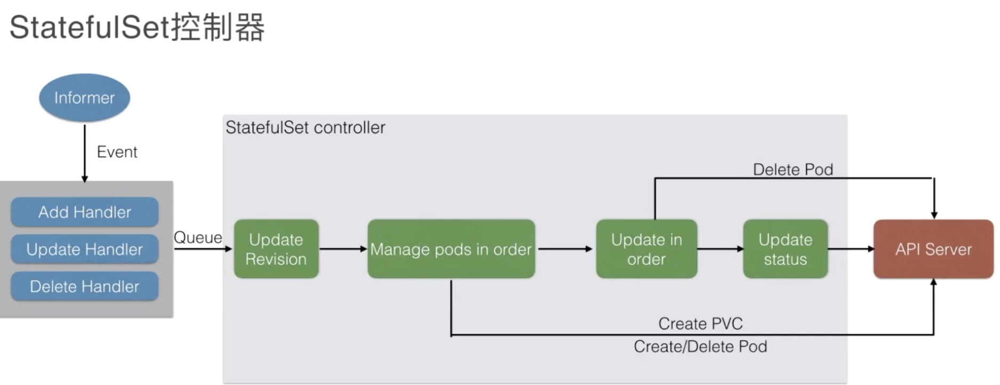
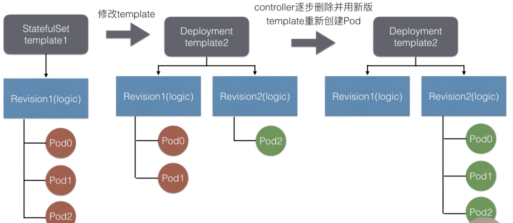

* [Lec22: kubernetes 有状态应用编排 StatefulSet](#lec22-kubernetes-有状态应用编排-statefulset)
   * [1. 需求分析](#1-需求分析)
      * [1. 课程回顾](#1-课程回顾)
      * [2. 需求](#2-需求)
   * [2. StatefulSet](#2-statefulset)
      * [1. 主要面向有状态应用管理的控制器](#1-主要面向有状态应用管理的控制器)
      * [2. StatefulSet 示例](#2-statefulset-示例)
   * [3. StatefulSet 架构设计](#3-statefulset-架构设计)
      * [1. 管理模式](#1-管理模式)
      * [2. 扩容策略](#2-扩容策略)
      * [3. 发布模拟](#3-发布模拟)

Created by [gh-md-toc](https://github.com/ekalinin/github-markdown-toc)

### Lec22: kubernetes 有状态应用编排 StatefulSet

#### 1. 需求分析

##### 1. 课程回顾

Deployment： 定义一组期望的  pod, pod 的数量与期望数量保持一致，在更新期间可以限制不可用 pod 在一定的范围，发布或更新有问题可以一键回滚；核心：同版本的 deployment 的 pod 都是一样的

##### 2. 需求

1. 某些应用的 pod 之间并非相同的，每个 pod 有自己的标识
2. pod 独立的标识对应不同的网络标识，在升级后关系保持不变
3. 独立的 pod 之间挂载不通的存储，当发布升级后，如何保证挂载的存储不变
4. 应用发布时按照顺序升级 Pod

#### 2. StatefulSet

##### 1. 主要面向有状态应用管理的控制器

不但可以在有状态应用中使用，还可以在无状态中使用

特点：

1. 每一个 pod 会按照序号进行创建、删除、更新
2. 通过设置 headless service 使得每一个 pod 有唯一的网络标识 hostname
3. 通过 pvc template ，每一个 Pod 有独立的 pv 存储盘
4. 支持指定数量的灰度发布

##### 2. StatefulSet 示例

```yaml
apiVersion: v1
kind: Service
metadata:
  name: nginx
  labels:
    app: nginx
spec:
  ports:
  - port: 80
    name: web
  clusterIp: None
  selector: 
    app: nginx
```

```yaml
apiVersion: v1
kind: StatefulSet
metadata:
  name: nginx-web
spec:
  selector:
    matchLabels:
      app: nginx
    serviceName: "nginx"
    replicas: 3
    template:
      metadata:
        labels:
          app: nginx
      spec:
        containers:
        - name: nginx
          image: nginx:alpine
          ports:
          - containerPort: 80
            name: web
          volumeMount: 
          - name: www-storage
            mountPath: /usr/share/nginx/html
   volumeClaimTemplates:
   - metadata: 
       name: www-storage
     spec:
       accessModes: ["ReadWriteOnce"]
       resources:
         requests:
           storage: "20Gi"
```

Deployment 使用 ReplicasSet 对 pod 进行管理，这里 statefulSet 直接对 Pod 进行管理，通过 -L controller-revision-hash 标识版本

更新镜像 

```bash
kubectl set image statefulset nginx-web nginx=nginx:mainline
```

#### 3. StatefulSet 架构设计

##### 1. 管理模式

创建管理资源：

1. ControllerRevision: 通过这个资源可以很方便的管理不同版本的 template
2. PVC: 如果在 statefulSet 中定义 volumeClaimTemplates , 会在创建之前根据这个模板创建 PVC，并将 PVC 加入到 pod voulmes 中
3. Pod



##### 2. 扩容策略

修改 `spec.podManagementPolicy` 可选为 OrderedReady（默认） 和 Parallel ；前者表示扩容按照顺序，缩容按照倒叙；后者是并行扩缩容，不需要等待

##### 3. 发布模拟



通过 partation 字段指定[0,N)保持旧版本，[N,M) 新版本
