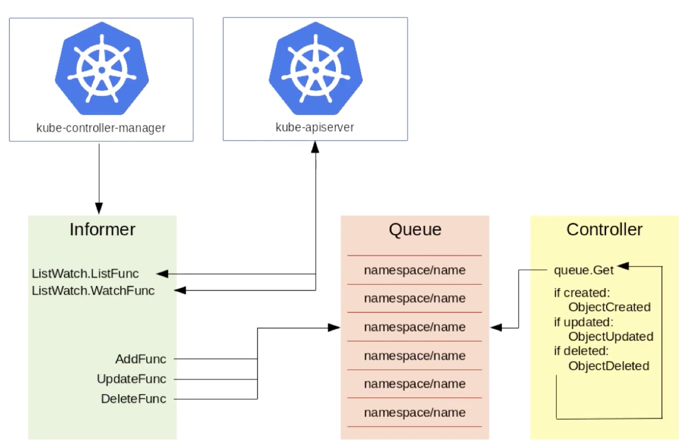

* [Lec23: Kubernetes API 编程范式](#lec23-kubernetes-api-编程范式)
   * [1. Custom Resource Definition(CRD)](#1-custom-resource-definitioncrd)
      * [1. 背景](#1-背景)
      * [2. 简单介绍](#2-简单介绍)
   * [2. Controller](#2-controller)
      * [1. Kube-control-manager 工作流程：](#1-kube-control-manager-工作流程)

Created by [gh-md-toc](https://github.com/ekalinin/github-markdown-toc)

### Lec23: Kubernetes API 编程范式

#### 1. Custom Resource Definition(CRD)

##### 1. 背景

1. 需求增多
2. 希望 k8s 提供聚合各种资源的功能
3. k8s 原生资源无法满足
4. k8s apiserver 扩展比较复杂

##### 2. 简单介绍

1. 在 1.7 被引入
2. 可以根据自己的需求添加自定义 k8s 对象资源
3. 和内置资源一样可以使用 cli 控制，同时可以使用安全、RBAC 等功能
4. 同时用户可以自定义控制器，对资源进行控制

simple:

```yaml
apiVersion: apiextensions.k8s.io/v1beta1
kind: CustomResourceDefinition
metadata:
  name: foos.samplecontroller.k8s.io
spec:
  group: samplecontroller.k8s.io
  version: v1alpha1
  names:
    kind: Foo
    plural: foos # 缩写
  scope: Namespaced
 
---

apiVersion: samplecontroller.k8s.io
kind: Foo
metadata:
   name: example-foo
spec:
  deploymentName:  example-foo
  replicas: 1

```

CRD  校验 simple:

```yaml
apiVersion: apiextensions.k8s.io/v1beta1
kind: CustomResourceDefinition
metadata:
  name: foos.samplecontroller.k8s.io
spec:
  group: samplecontroller.k8s.io
  version: v1alpha1
  names:
    kind: Foo
    plural: foos # 缩写
  scope: Namespaced
 
---

apiVersion: samplecontroller.k8s.io
kind: Foo
metadata:
   name: example-foo
spec:
  deploymentName:  example-foo
  replicas: 1
  validation:
    openAPIV3Scheme:
      properties:
        spec:
          properties:
            replicas:
              type: integer
              minimum: 1
              maxmium: 10
  status: {} # 1.12 后增加的状态字段
```

#### 2. Controller

##### 1. Kube-control-manager 工作流程：



Informer 机制 Watch Apiserver: List Watch(建立长连接，当资源有变动时会反馈回来，资源被存在一个 queue  里面 namespace/name )

然后会有一个queueActionLocked 函数 给 queue里要操作的增加 op ,后将其 pop 出来，被指定的handler 接收后进行处理 


