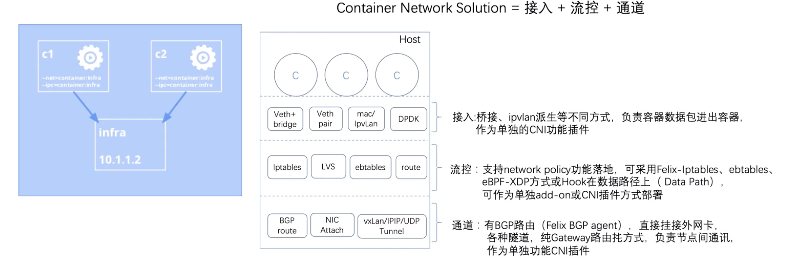
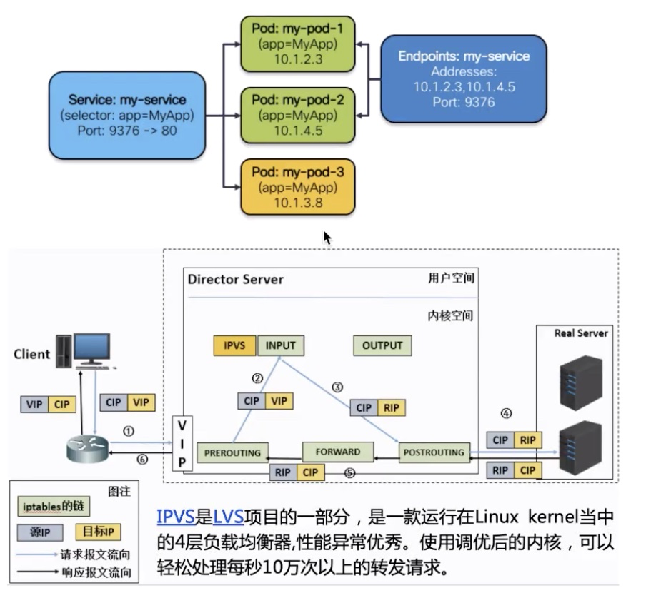

* [LEC25: Kubernetes 网络模型选型](#lec25-kubernetes-网络模型选型)
   * [1. K8s 网络的起源](#1-k8s-网络的起源)
      * [1. 来源](#1-来源)
      * [2. 改造](#2-改造)
   * [2. 网络包如何传送](#2-网络包如何传送)
      * [1. 双维度](#1-双维度)
      * [2. 最简单的路由方案：Flannel-host-gw](#2-最简单的路由方案flannel-host-gw)
   * [3. Service](#3-service)
      * [1.  Internal Load balance @Client](#1--internal-load-balance-client)
      * [2. 三步实现一个 LVS service](#2-三步实现一个-lvs-service)
   * [4. Service 类型](#4-service-类型)
      * [1. 一种真正工作云，从0搭建负载均衡系统](#1-一种真正工作云从0搭建负载均衡系统)

Created by [gh-md-toc](https://github.com/ekalinin/github-markdown-toc)

### LEC25: Kubernetes 网络模型选型

#### 1. K8s 网络的起源

##### 1. 来源

来源于 docker 的 bridge 网络

1. 将容器网络和外部解耦，出宿主机 SNAT 借用宿主机的 IP 访问外部网络，进宿主机 DNAT 借用宿主机的端口进入
2. 缺点：无法区分哪些是容器流量，哪些是宿主机流量

##### 2. 改造

1. pod 拥有独有的 IP，不能通过 NAT 改造
2. pod 内部共享 IP

#### 2. 网络包如何传送

##### 1. 双维度

1. 协议层 L2(mac 寻址层) -》 L3(IP 寻址层) -》 L4+(4层协议和端口)
2. 网络拓扑 容器空间-》宿主机空间-》外部



##### 2. 最简单的路由方案：Flannel-host-gw


1. IPAM 方案： 每个 Node 独占网段 subnet，网关在本地，映射再 cni 的网桥端口上，pod 无法飘到别的node上
2. 上图 ip route 之后，解析
   1. 第一条默认路由通过哪个 ip 地址走掉
   2. 第二条是对 subnet 的反馈，发到网桥 10.244.0.0/24 的包会到  10.244.0.1 网关上
   3. 当时别到  10.244.1.0/24 网桥，发送到 10.244.0.3 网关，即另一个 node 的ip
3. Pod1 的包到 Pod2: 
   1. 本地路由将本 node 的 cni0 作为默认网关，根据路由决定目的 mac，同属于一个 subnet 会直接（mac 层的交换）发到另一个容器，如果是另一个网段，需要 Gw-mac （cni0 桥）通过 pod netns 内的 veth pair 发送到 cni0 桥
   2. Mac-桥转发：Bridge 默认的行为是按照 Mac 进行转发，如果目的的 Mac 为本地某 pod 就直接转发，如果不是就送到主机的 HOST 栈上
   3. ip 主机-路由转发：这个时候剥离  mac 层，进入 IP 寻址层，如果目的 mac 为本机 GW(cni0) 送到本地进程，如果是其他网段，查询本地路由表，找到该网段对应的远端 Gw-ip，通过 neigh 系统查询到远端 Gw-ip 的 mac 地址，作为数据的目的 Mac，同步 eth0 传过去；注意如果 node 之间不是二层网络有其他路由信息，就无法直达
   4. IP-远端路由转发，由于 mac 地址的指引，数据包准确到达远端节点，通过 eth0 进入主机协议栈，查询路由表找到该网段对应的 cni0 的 IP 
   5. mac-远程桥转发： IP 层的处理末端填写目的 IP 的 mac，通过 bridge(因为cni0 作为 host internal port on Bridge) fbd 表查出 Mac(否则发 arp 广播)通过 bridge mac 转发，找到目标容器的 netns

#### 3. Service

##### 1.  Internal Load balance @Client

1. 一群 pod 作为功能后端
2. 定义一个稳定的 vip 作为访问前端，并附赠 DNS 域名
3. kube-proxy 是核心，通过 api-server 检测 pod 和 service 的变化反馈到 LB 配置中
4. LB 的实现机制和目标解耦，可以是一个用户态进程，也可以是一群规则（iptables 、ipvs）

##### 2. 三步实现一个 LVS service

目的：让 kernel 认为 vip 是本地地址



1. 绑定 vip 到本地

   ```
   ip route add to local 192.168.60.200/32 dev eth0proto kernel
   ```

2. 为 vip 创建一个 ipvs 的 virtual server

   ```
   ipvsadm -A -t 192.168.60.200:9376 -s -rr -p 600
   ```

3. 为 ipvs service 创建 real server

   ```
   ipvsadm -a -t 192.168.60.200:9376 -r 10.1.2.3:80 -m
   ipvsadm -a -t 192.168.60.200:9376 -r 10.1.4.5:80 -m
   ipvsadm -a -t 192.168.60.200:9376 -r 10.1.3.8:80 -m
   ```

#### 4. Service 类型

1. ClusterIP: 只能在集群内部使用
2. NodePort: 在 ClusterIP 的基础上，将服务暴露到 Node 的端口上
3. LoadBalancer: 云厂商，将 LB 挂载到xxx
4. ExternalName:LB 工作外部实现

##### 1. 一种真正工作云，从0搭建负载均衡系统


