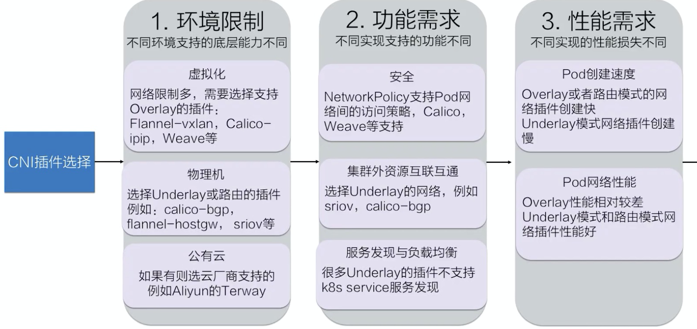

* [Lec26: 理解 CNI 和 CNI 插件](#lec26-理解-cni-和-cni-插件)
   * [1. CNI 介绍](#1-cni-介绍)
      * [1. 什么是 CNI？](#1-什么是-cni)
   * [2. 在 K8s 中如何使用](#2-在-k8s-中如何使用)
      * [1. 如何配置](#1-如何配置)
      * [2. 内部如何调用](#2-内部如何调用)
   * [3. 如何选择 CNI 插件](#3-如何选择-cni-插件)
      * [1. CNI 插件的三种模式](#1-cni-插件的三种模式)
      * [2. 三个维度选择容器网络](#2-三个维度选择容器网络)
   * [4. 如何开发 CNI 插件](#4-如何开发-cni-插件)
      * [1. CNI 实现两个部分](#1-cni-实现两个部分)

Created by [gh-md-toc](https://github.com/ekalinin/github-markdown-toc)

### Lec26: 理解 CNI 和 CNI 插件

#### 1. CNI 介绍

##### 1. 什么是 CNI？

1. CNI 是容器网络接口的意思，是容器网络的 API 接口
2. kubelet 通过这个标准的 API 调用不同的网络插件实现配置网络
3. CNI 插件，实现 CNI 网络接口的插件

#### 2. 在 K8s 中如何使用

##### 1. 如何配置

1. 配置文件在 `/etc/cni/net.d/xxnet.conf`
2. 二进制插件放在 `/opt/cni/bin/xxnet`
3. 该节点创建的 pod 会通过 kubelet 去根据 CNI 的配置调用 CNI 二进制文件配置容器网络

##### 2. 内部如何调用

目前大多数cni 插件是以 Daemonset 方式部署在各个节点上，配置也通过 configmap 进行配置

#### 3. 如何选择 CNI 插件

##### 1. CNI 插件的三种模式

1. Overlay： 有独立于主机的 ip 段，在主机间构建隧道，将容器网络包封装成主机之间的包
2. 路由：也有独立网段，通过路由打通
3. Underlay：容器网段和宿主机是同网段

##### 2. 三个维度选择容器网络

#### 4. 如何开发 CNI 插件

##### 1. CNI 实现两个部分

1. 二进制文件用于配置 Pod 的网卡和 IP

   

   1. 创建一个虚拟网卡，步骤1：创建一个网卡对，步骤2：将一个网卡移到 pod 里面
   2. 给 pod 分配 ip 地址：pod 网段按照 node 进行分段，后分配唯一的 IP 地址
   3. 配置 pod 的 ip 和路由：将分配的 IP 配置到网卡，并为网卡配置集群网段的路由。当到宿主机指向 pod ip 会将其路由到 之前创建的网卡对在 node 的一方上

2. daemon 进程

   1. CNI daemon 会获取所有的 pod 的ip 以及节点信息（通过监听 k8s apiserver）
   2. 根据 ip 和 node 信息配置打通网络
      1. 创建 Node 通道：Overlay隧道、VPC 路由表、BGP 路由
      2. 将 pod ip 和 Node 打通：Linux 路由、Fdb转发表、OVS流表
