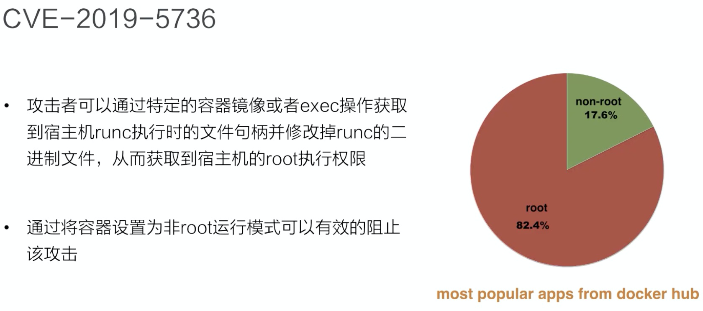

* [Lec27: Kubernetes 安全之访问控制](#lec27-kubernetes-安全之访问控制)
   * [1. Kubernete API 请求](#1-kubernete-api-请求)
      * [1. 调用过程](#1-调用过程)
   * [2. K8s 认证](#2-k8s-认证)
      * [1. K8s 用户模型](#1-k8s-用户模型)
      * [2. X509 认证](#2-x509-认证)
      * [3. 证书签发 api](#3-证书签发-api)
      * [4. 如何签发用户证书](#4-如何签发用户证书)
      * [5. Service Account](#5-service-account)
      * [6. 生成 kube config](#6-生成-kube-config)
      * [7. 如何使用 kube config](#7-如何使用-kube-config)
   * [3. K8s 鉴权 RBAC](#3-k8s-鉴权-rbac)
      * [1. Role](#1-role)
      * [2. RoleBindings](#2-rolebindings)
      * [3. ClusterRole](#3-clusterrole)
      * [4. ClusterRoleBindings](#4-clusterrolebindings)
      * [5. 组件 RBAC 控制](#5-组件-rbac-控制)
      * [6. 角色 verbs 如何设定](#6-角色-verbs-如何设定)
   * [4. Security Context](#4-security-context)
      * [1. Kubernetes Runtime 安全策略](#1-kubernetes-runtime-安全策略)
      * [2. Pod Security Policy](#2-pod-security-policy)
      * [3. 多租加固](#3-多租加固)

Created by [gh-md-toc](https://github.com/ekalinin/github-markdown-toc)

### Lec27: Kubernetes 安全之访问控制

#### 1. Kubernete API 请求

##### 1. 调用过程

1. kubectl 或者 业务中的 Pod（service account） 调用 api
2. api 进行 authentication 认证，认证用户，非法返回401
3. authorization 验证用户是否有权限进行请求中的操作，无权限返回403
4. Admission control 请求是否安全合规，后请求实体化为 k8s object 并存储到 etcd 中

#### 2. K8s 认证

##### 1. K8s 用户模型

1. k8s 没有自身的用户管理能力，不能像管理 Pod 一样管理，也无法直接在 etcd 中查看实例
2. 一般通过请求凭证设置，user= group= 
3. k8s 验证方式如下
   1. basic 一般在测试场景，通过 apiserver 读取的静态文件上的 username 和 passwd 
   2. x509 证书认证 由集群 ca 签发或者apiserver-client-ca 中的授信 ca 签发的客户端证书去访问apiserver，接收到请求后会进行 tls 握手流程认证证书的合法性，apiserver 还会校验请求的原地址信息
   3. Bearer Token(Json Web Tokens): 
      1. Service Account
      2. OpenID Connect
      3. Webhooks

##### 2. X509 认证

1. 认证机构

   1. 公钥`/etc/kubernetes/pki/ca.crt`
   2. 私钥`/etc/kubernetes/pki/ca.key`

2. 集群中的各个组件的证书都是集群根 CA 签发的

3. 其中两个重要字段

   1. Common Name(CN): 作为认证的 user
   2. Organization(O): 作为认证的 group
   3. `openssl x509 -in ca.crt -noout -text ` 查看

4. 集群各组件认证

   |        组件        | Common name                    | Organizations |
   | :----------------: | ------------------------------ | ------------- |
   | Controller-manager | System:kube-controller-manager |               |
   |     Scheduler      | System:kube-scheduler          |               |
   |     Kube-proxy     | System:kube-proxy              |               |
   |      Kubelet       | System:node:$(node-name)       | System:nodes  |

##### 3. 证书签发 api


1. kubernetes 提供证书签发的  api : `certificates.k8s.io/v1beta1` 
2. 客户端将证书签发请求发送到  apiserver
3. 签发请求会以  csr 资源模型形式持久化
4. 新创建 csr 会处于 pending 的状态，等待管理员 approve
5. 一旦 csr 完成 approved 请求的证书被签发

##### 4. 如何签发用户证书

1. 生成私钥 `openssl genrsa -out test.key 2048`
2. 生成 csr `openssl req -new -key test.key -out test.csr -subj "/CN=dahu/O=devs"`
3. 通过 API 创建 k8s csr 实例等待管理员审批
4. 集群管理员操作：`openssl x509 -req -in dahu.csr -CA CA_LOCATION/ca.crt -Cakey CA_LOCATION/ca.key Cacreateserial -out dahu.crt -days 365`

##### 5. Service Account


1. SA 是 k8s 中唯一可以通过 api 进行管理 apiserver 访问凭证
2. 通常用于业务的 pod  中的进程和集群交互使用
3. 当一个 namespace 创建后会有一个 default 的 SA和 secret 被创建
4. 可以创建 sa 挂载到运行时的 pod 中


SA 的 token 会被传到 secret 的 data 中


应用可以通过制定 serviceAccountName 挂载 SA

##### 6. 生成 kube config

1. 需要集群的 ca
2. Kubectl 添加连接信息 `kubectl config set-cluster sandbox --certificate-authority=ca.pem --embed-certs=true -server=https://<集群地址>:6443`
3. 将秘钥添加到 kubectl 配置中 `kubectl config set-credentials dahu --client-certificate=dahu.crt --client-key=dahu.key --embed-certs=true`
4. 将新的 context 加入 kubectl 配置中 `kubectl config set-context sandbox-dahu --cluster=sandbox --user=dahu`

##### 7. 如何使用 kube config

1. 设置KUBECONFIG 环境变量，或者追加 `export KUBECONFIG=$KUBECONFIG:$HOME:/.kube/config`

2. 多集群 context 切换和合并

   ```bash
   KUBECONFIG=file1:file2:file3 kubectl config view --merge --flatten > ~/.kube/all-config export KUBECONFIG=~/.kube/all-config
   kubectl config get-contexts
   kubectl config use-context [your-context]
   ```

#### 3. K8s 鉴权 RBAC

who do what 三个方向对应的 k8s 资源是 Subject(可以是用户或者pod 中的系统进程或者业务逻辑进程) Verbs Resource,其中可以通过 namespace 进行物理隔离，不绑定会拒绝所有访问，可以到资源的子资源级别，如 nodes/status

##### 1. Role


##### 2. RoleBindings

使用角色 Role 主体在该 namespace 下的绑定关系，将 role 绑定到 subject 上


支持绑定多个 subject

##### 3. ClusterRole

PV或者 Node这种在 namespace 下不可见的集群资源的角色限定


##### 4. ClusterRoleBindings


##### 5. 组件 RBAC 控制

1. System:basic-user: 未认证的用户组（group system:unauthorized）默认角色，不具备任何操作权限
2. Cluster-admin: system:masters 组默认的集群角色绑定，通过绑定 cluster-admin 的 role 具备集群所有资源的操作权限
3. 集群组件默认 clusterrolebindings 

##### 6. 角色 verbs 如何设定


#### 4. Security Context



##### 1. Kubernetes Runtime 安全策略

1. 权限最小化原则
2. 在 pod 或者 container 维度设置 Security Context
3. 使用 pod security policy
4. 开启 admission controller 校验容器
   1. ImagePolicyWebhooks 支持外部 webhook 对于镜像进行校验
   2. AlwaysPullimages 多租户环境下防止镜像被恶意篡改


##### 2. Pod Security Policy


1. 在 apiserver 设置选项的 admission-plugin 中设置PodSecurityPolicy
2. 在集群中创建指定的 psp 实例
3. 配置 策略和身份绑定，一般身份是 sa
4. 最好设定一个集群的全局策略，因为开启后 pod 必须在鉴权的时候找到策略实例
5. psp 策略使用顺序
   1. 优先使用 非 mutating 即不改变 pod 模型策略
   2. 如果过滤后有多个，按照name字母排序选取第一个

##### 3. 多租加固

1. 基于 namespace 和 RBAC 的软隔离是必要的措施
2. 使用 psp 加固pod 安全参数的校验，加固容器运行时的安全
3. 使用 Resource Quota/Resource Limit 对于资源配额进行限定
4. 敏感信息保护（secret encryption at REST对应后端 KWS Provider）
5. 应用运行权限最小化原则
6. 使用 NetworkPolicy 对于业务东西向网络流量的控制
7. Log everything
8. 监控
