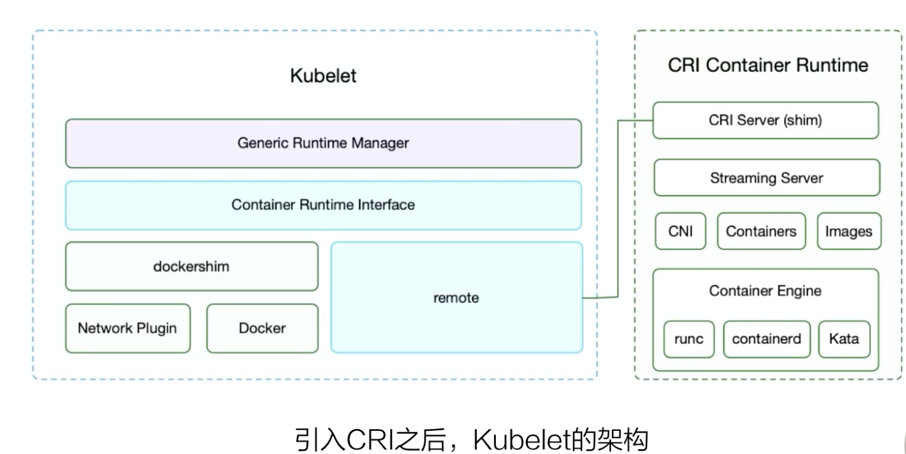
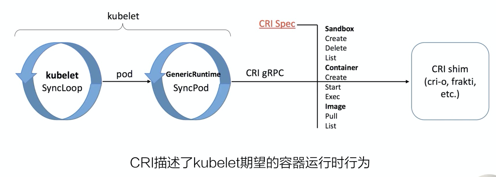
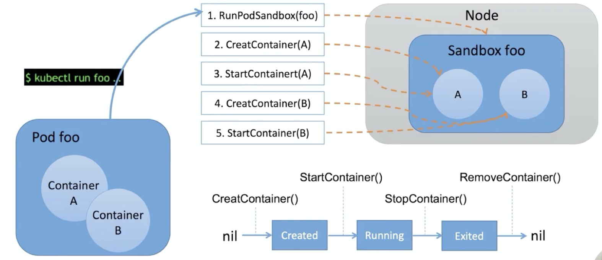
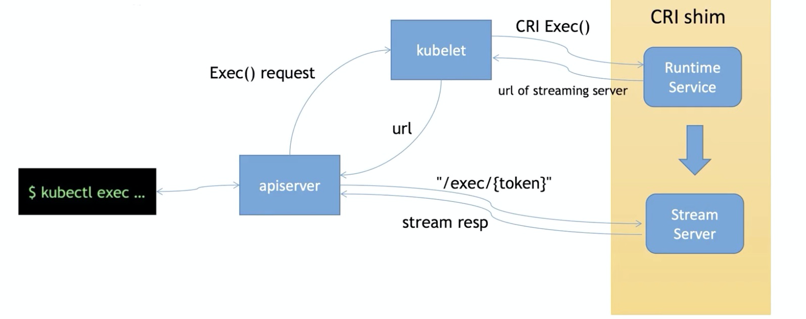
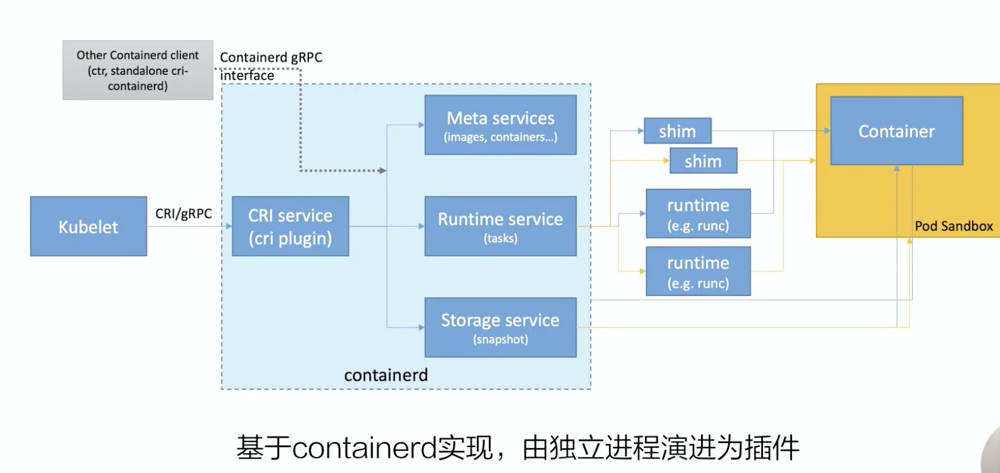
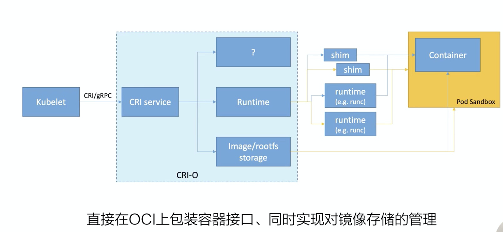

### Lec28: 理解容器运行时 CRI

#### 1. CRI 的由来

1. k8s 1.5 之前使用 docker 直接作为容器运行时，使用 dockershim 直接调用 docker 接口

2. 之后 rkt 也加入容器运行时，这时候存在 m*n 的问题

3. cri 使用那时候刚开源的 grpc(性能优于 Http 和 resetful 通信协议，不需要写客户端和服务端代码)
4. Cri 抽象出了一套直接操作 pod 的接口

#### 2. CRI 的实现

 	1. Cri server: 创建删除容器
      	1. stream server： exec 或者 port-forward attach 流式数据
 	2. cni 等资源创建
 	3. Containerd 创建具体容器

##### 1. CRI Server

1. 创建 sandbox ，持有 pod 相关资源
2. 在 pod 空间中创建业务容器
3. 销毁容器 先 stop 后 remove

##### 2. Stream Server

1. 请求到 apiserver 鉴权
2. 后到 Kubelet 调用 CRI Exec接口
3. stream server 异步的调用 stream server ，后 runtime server 返回 kubelet stream server 的地址后给带 apiserver
4. apiserver 从 stream server 获取流式数据

#### 3. 常用的 CRI

##### 1. CRI-Containerd

1. 基于 containered 实现，后演化成插件
2. ctrl 可以通过接口单独操作插件

##### 2. CRI-O

1. 在 OCI 上直接包装
2. 对 runtime的管理以及对于镜像的管理

#### 4. 相关的工具

1. crictl 帮助开发者和用户调试容器
2. Critest 验证 cri 接口的测试工具，验证是否满足 kubelet 的需要
3. 性能测试 工具，测试接口性能
4. 具体参见 [cri-tools](https://github.com/kubernetes-sigs/cri-tools)