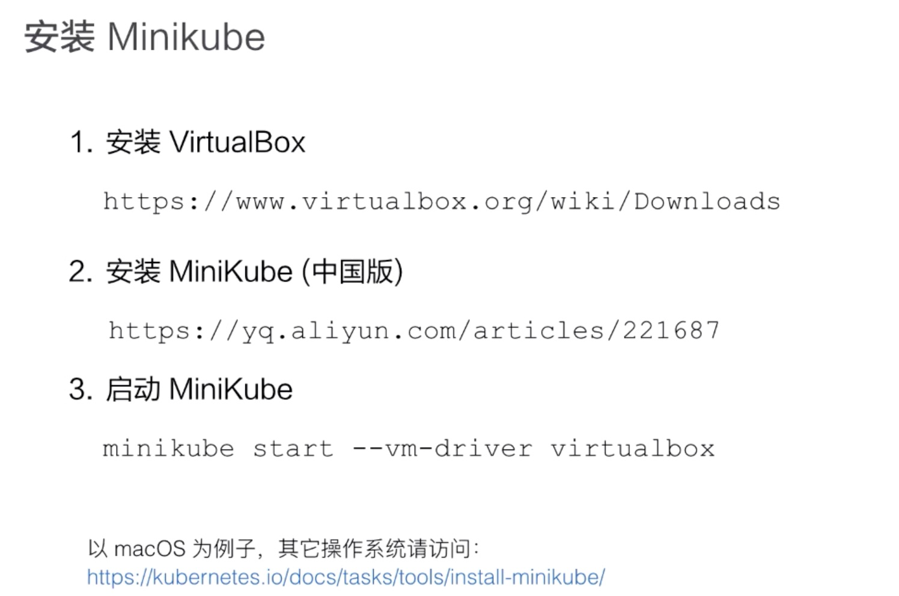

### Lec3: Kubernetes 核心概念

##### 1. kubernetes(k8s) 是什么？

k8s 是自动化容器编排平台，部署 -》 弹性 -》管理

核心功能：

1. 服务发现和负载均衡
2. 容器的自动装箱 (scheduler)
3. 存储编排：连接存储生命周期和容器的生命周期
4. 自动容器恢复 (对节点进行健康检查，将unhealthy 容器迁移)
5. 应用自动发布和回滚
6. 配置密文的管理
7. 批任务处理
8. 任务水平伸缩 (业务负载检查，并扩展进行负载均衡)

##### 2. k8s 的架构

k8s 是 c/s 的双层架构 cmd/ui -> master -> nodes

K8s 组件：

1. apiserver: 集群外访问以及集群内部组件之间的 api 连接；可水平拓展部署组件
2. Controller-manager： 对集群状态进行管理；可热备部署组件，但是真正作用只有一个
3. scheduler: 最优调度操作；可热备部署组件，但是真正作用只有一个
4. Etcd: 分布式存储系统， apiserver 需要的元信息存储在 etcd 中，保证数据的一致性

##### 3. k8s 的 工作节点 node

kubelet : CRI(Container Runtime Interface)、 CNI (Container Network Interface)、Storage Plugin、kube-proxy(原生的使用 iptables(新版的 ipvs) 的能力 对于 cluster network)

云厂商可由 CRI CNI 和存储接口进行拓展 

pod -> apiserver(etcd 写入) -> (watch or nitify)scheduler -> apiserver(etcd 写入pod-node 信息) -> node(kubelet -CNI -...) 


##### 4. k8s 核心概念

###### pod

Pod 是最小的调度和资源单元，由一个或多个容器的组成，定义容器运行方式，提供容器共享运行环境(网络、进程空间)

###### volume

声明在 pod 中的可访问的文件目录，可挂载在 pod 中一个或者多个容器指定目录文件下。支持本地存储、分布式存储、云存储...

###### Deployment

定义一组 pod, 是 deployment controller 对于 pod 健康数目进行控制， 可以进行滚动升级、回滚

###### service

访问一个或者多个 pod 实例的稳定的访问地址

ClusterIp、NodePort、LoadBalance...

###### namespace

集群内部进行逻辑隔离(鉴权、资源)；同一个 namespace 中的资源命名唯一


##### 5. API 基础知识

kubectl/ui/curl :  http + json(yaml)

`/api/v1/namespaces/$NAMESPACE/pods/​$NAME`

Spec 是期望的状态， controller 会拿他和 目前的 pod  status 做一些处理 ；

Label: KeyValuePair , 可被 Selector 查询到，是资源集合的默认表达形式

```yaml
apiVersion: v1
kind: Pod
metadata:
  name: nginx
  label:
    name: nginx
spec:
  container:
  - name: nginx
    image: nginx
    ports:
    - containerPort: 8080
```


