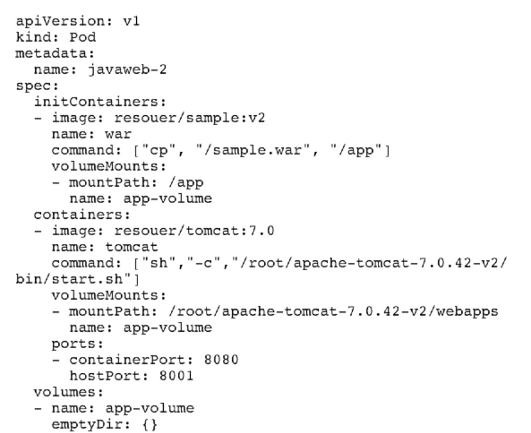

* [Lec4: 理解 pod 和容器设计模式](#lec4-理解-pod-和容器设计模式)
    * [1. 为什么需要 pod ?](#1-为什么需要-pod-)
    * [2. 为什么将 pod 最为原子单位？](#2-为什么将-pod-最为原子单位)
    * [3. Pod 实现机制？](#3-pod-实现机制)
    * [4. 详解容器设计模式？](#4-详解容器设计模式)
    * [5. 什么是 sidecar 模式？](#5-什么是-sidecar-模式)
    * [所有的设计模式都是为了解耦和重用](#所有的设计模式都是为了解耦和重用)
   * [引用](#引用)

Created by [gh-md-toc](https://github.com/ekalinin/github-markdown-toc)

### Lec4: 理解 pod 和容器设计模式

##### 1. 为什么需要 pod ?

容器的本质：视图受限制，资源被隔离的进程 (pid=1 就是容器本身),，进程组(在linux 中是线程，Linux中线程作为轻量级的进程)

容器作为单进程模型，其本身将 pid=1 作为自己的 main 进程，如果多个进程则需要 systemd 作为 pid=1 的管理进程，这是应用本身的进程(生命周期)就不可控。

Pod = "进程组" ， pod 作为一个逻辑单元，多个进程共享资源，Pod 被k8s 原子的调度。

##### 2. 为什么将 pod 最为原子单位？

当两个应用，比如 App、Log，Request 1GB and 0.5GB , 资源池中 NodeA 1.25GB NodeB 2GB, 如果APP被调度到 NodeA , Log 将不会调度到 NodeA, 刀子两者不会共享资源。Named: Co-Scheduler 问题：

1. Mesos: 资源囤积(Resource hoarding)， 等待设置Affinity约束的任务全部到达才开始统一的调度，可能会损失效率甚至造成死锁
2. Omega:乐观调度，先调度，出现冲突进行回滚操作(很复杂，悲观锁一定比乐观锁简单)
3. Kubernetes: Pod
   1. 超亲密关系：通过 Pod，发生直接的文件传递，使用 localhost 或者 socket 通信，发生非常频繁的 rpc 调用，共享一些 linux 的 namespace,例如一个容器加入另一个容器的 network namespace,这样可以查看其网络设备和信息  
   2. 亲密关系：通过调度

##### 3. Pod 实现机制？

1. 如何使多个容器原本被 linux namespace 和 cgroup 隔离变得可共享？
   1. 如何共享网络 ？使用 infra container(pause 汇编编写，永远处于暂停状态) 获取整个 Pod 的网络； Pod 中的 容器 A、容器B都使用 localhost 直接进行 通信，其网络视图是一致的。Pod 的 network namespace 对应的  IP 地址就是 Pod 的 IP。整个 Pod 的生命周期是和  Infra container 一致的。
   2. 如何共享存储 ？挂载相同的 volume 即可

##### 4. 详解容器设计模式？

上图为 使用 InitContainer 将 war 包提前更新到 volume 后，tomcat 的 container 启动，我们称这类设计模式为 sidecar 模式

##### 5. 什么是 sidecar 模式？

 通过在 pod 中定义专门的容器，来执行主业务容器的辅助工作：

- 需要 ssh 进去执行的脚本
- **日志搜集** ：如 Fluented(业务容器写日志到 volume 中，日志容器共享 volume 后转发到远程存储中)
- Debug 
- 监控 Prometheus
- **代理(proxy)** ：使用 proxy 容器代理业务容器访问外部集群(业务容器和代理容器之间使用 localhost 直接通信没有性能损耗)
- **适配器( Adapter)** ：适配器容器将业务容器暴露出的接口格式转换成外部需要的接口格式；例如：业务容器暴露接口 /metrics, 而监控系统监控 /healthz, 写一个 adapter 将 结构进行转换

##### 所有的设计模式都是为了解耦和重用

#### 引用

- [Large-scale cluster management at Google with Brog, EuroSys 15](<http://static.googleusercontent.com/media/research.google.com/zh-CN//pubs/archive/43438.pdf>)

