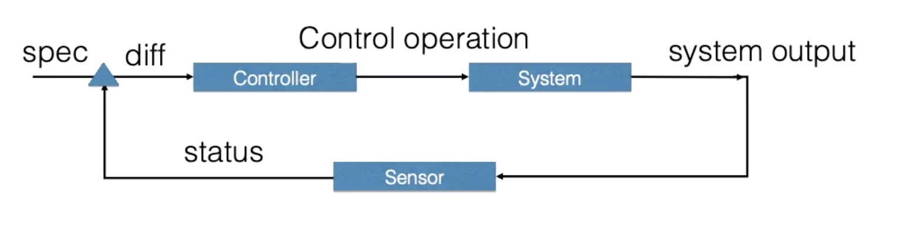
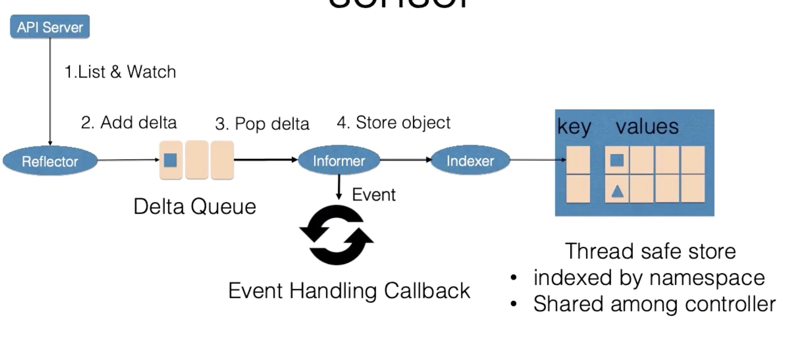
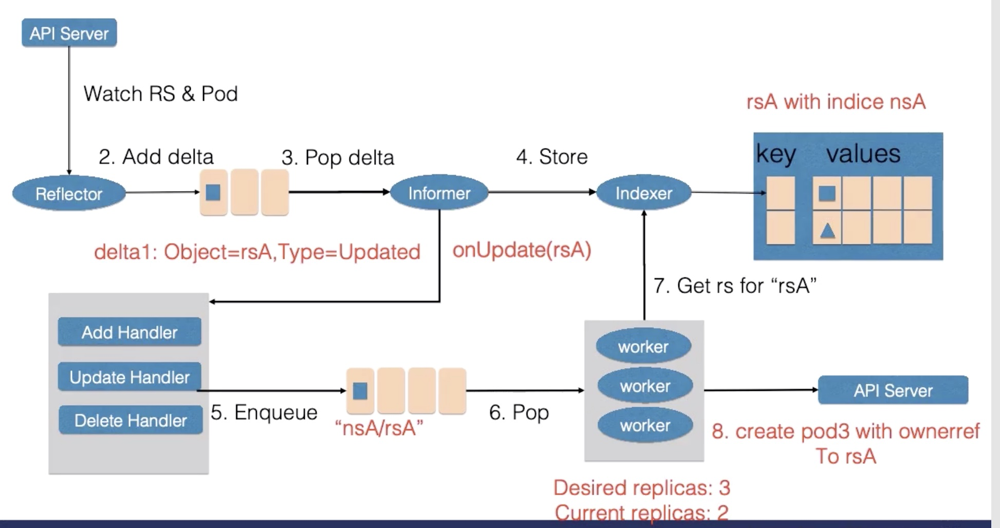
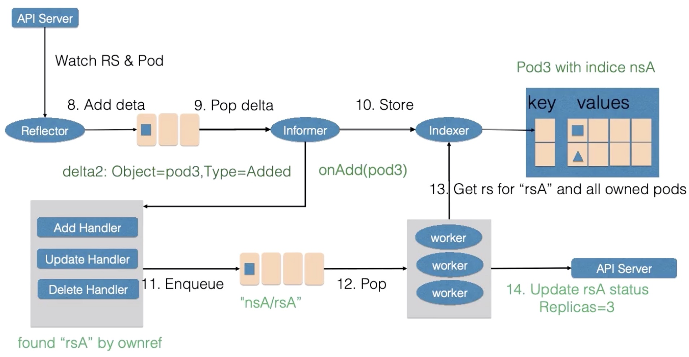
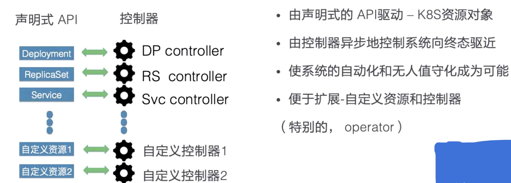

### Lec4: 应用编排与管理：核心原理

##### 1. k8s 的资源对象组成

- Spec(期望的状态)

- Status(目前的状态)

- Metadata

  - Label(资源的标签)： 标识性 Key: Value 元数据，用于筛选资源，也可以使用 selector 类似 SQL

    - Selector
      - 相等型，并列与关系
      - 集合型ENV in(notin) (Ubuntu, Centos)

    ```bash
    # ENV is not exist
    kubectl label pods xxx ENV=test
    # ENV is exist
    kubectl label pods xxx ENV=dev --overwrite
    kubectl label Pods xxx ENV-
    kubectl get pods --show-labels
    kubectl get pods --show-labels -l ENV=test
    kubectl get pods --show-labels -l 'ENV in (test, dev)'
    
    kubectl annotate pods xxx my-annotate='xxx, ok'
    ```

    

  - Annotation(资源的注解，描述资源): 系统存储资源的非标识信息，可以拓展资源的 spec 或者 status

  - OwnerRefrence(资源间的关系)：集合类资源控制器会创建归属资源，例如 statefulSet 会创建 Pod

    - Pod 的集合 ： statefulSet , replicaset
    - 作用：反向查找创建资源对象，联级删除

##### 2. 控制器模式



1. 控制器
2. 被控制的系统
3. 观测传感器

外界通过控制 spec 控制资源，通过 spec 和 status 计算 diff 决定控制器对于系统执行什么操作，新的输出被 sensor 以 status 的形式收集

##### 3. Sensor



1. Reflector(api server 通过 list&watch 获取资源状态)
   1. list 在  controller 重启以及 watch  中断的情况下进行系统资源的全量更新
   2. watch 在多次list 之间进行增量的更新
   3. 在获取新的资源信息后在 delta 队列中插入包含资源对象本身以及资源事件类型的的 delta 记录， delta 队列保证在同一个队列中仅有一条记录，避免 reflector 在重新 list & watch 的时候产生重复的记录
2. Informer
   1. 不断弹出的 delta 记录，一方面将资源的事件交给事件回调函数，同时将资源对象交给Indexer
3. Indexer
   1. Indexer 将资源对象记录在一个缓存中，默认使用资源的命名空间作为索引，可被 controller manager 的多个 controller 共享

##### 4. 控制组件

控制循环中的控制组件由：

1. 事件处理函数：监听 Informer 中的新增、更新、删除事件并根据控制器的逻辑决定是否需要处理，对需要处理的事件，会将事件关联资源的命名空间 和自己的名字塞入一个 工作队列中，会被worker 池中的 worker 处理。工作队列会对存储的对象进行去重，避免对个 worker 处理同一个 资源的情况
2. worker ：在处理资源对象时， 一般需要资源的名字重新获得新的资源数据用来创建或者更新资源对象，或者调用其他的外部服务，worker 处理失败的时候会将资源的名字重新加入到工作队列中

RelicaSet 表示 一个无状态资源的扩缩容的行为：

```yaml
apiVersion: app/v1
kind: ReplicaSet
metadata:
  name: rsA
  namespace: rsA
spec:
  replicas: 2
  selector:
    matchLabels:
      env: prod
    template:
      metadata:
        labels:
          env: prob
      spec:
        container:
        - image: mginx
          name: nginx
status:
  replicas: 2
```

Change spec: 2 to 3

Phase1: Forward



 Phase2: backword



##### 5. 控制器模式总结

控制器模式使用声明式的 API (相对于命令式的 API )，更加稳定，天然记录状态、幂等操作、正常 操作即巡检、可合并多个变更。

问题：

- 无响应怎么办？重试，记录状态，复杂
- 多次重试了怎么办？巡检修正，易出错
- 多方并发访问怎么办？ 加锁，复杂低效

