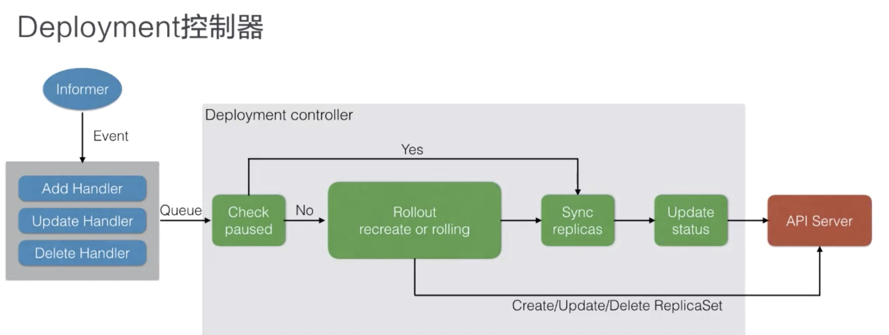
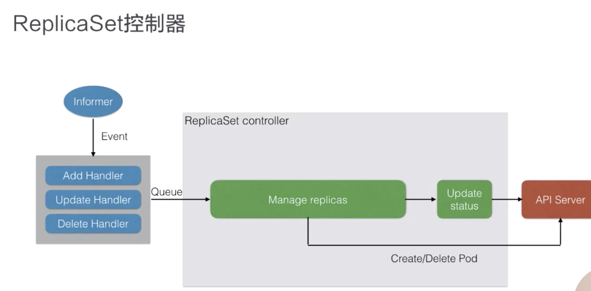

* [Lec6: 应用编排与管理-Deployment](#lec6-应用编排与管理-deployment)
      * [1. Backup](#1-backup)
      * [2. Deployment 用例](#2-deployment-用例)
      * [3. Deployment 管理模式](#3-deployment-管理模式)

Created by [gh-md-toc](https://github.com/ekalinin/github-markdown-toc)

### Lec6: 应用编排与管理-Deployment

##### 1. Backup

- 保证可用 pod 的数量
- 为特定的一群的 Pod 统一的一些操作，例如更新镜像
- 更新过程中如何保持一致性
- 更新失败的回滚操作

Deployment Controller 满足上面的需求

##### 2. Deployment 用例

```yaml
apiVersion: apps/v1
kind: Deployment
metadata:
  name: nginx-deployment
  labels:
    app: nginx
spec:
  replicas: 3
  selector:
    matchLabels:
      app: nginx
    template:
      metadata:
        labels:
          app: nginx
      spec:
        containers:
        - name: nginx
          image: nginx:1.7.9
          ports:
          - containerPort: 80
```

deployment 的命名格式： ${deployment_name}-{template-hash}-{random-suffix}

**注意：** deployment 的 pod 的 OwnerRef 是 ReplicaSet 而非 Deployment

```yaml
apiVersion: v1
kind: Pod
metadata:
  creationTimestamp: "2019-06-19T15:02:39Z"
  generateName: nginx-deployment-6dd86d77d-
  labels:
    app: nginx
    pod-template-hash: 6dd86d77d
  name: nginx-deployment-6dd86d77d-g7f8l
  namespace: default
  ownerReferences:
  - apiVersion: apps/v1
    blockOwnerDeletion: true
    controller: true
    kind: ReplicaSet
    name: nginx-deployment-6dd86d77d
    uid: 47d6db35-92a3-11e9-b4a2-080027730c60
  resourceVersion: "3808"
  selfLink: /api/v1/namespaces/default/pods/nginx-deployment-6dd86d77d-g7f8l
  uid: 47d81c9c-92a3-11e9-b4a2-080027730c60
```

更新 deployment  的镜像

```shell
$ kubectl set image deployment.v1.apps/nginx-deployment nginx=nginx:1.9.1 #first nginx is container name

nginx-deployment-6dd86d77d-95v4k   1/1     Running   0          4s                                  
nginx-deployment-6dd86d77d-njcf2   1/1     Running   0          4s                                   
nginx-deployment-6dd86d77d-rk89p   1/1     Running   0          4s                                   
nginx-deployment-784b7cc96d-vksl2   0/1     Pending   0          1s                                   
nginx-deployment-784b7cc96d-vksl2   0/1     Pending   0          1s                               
nginx-deployment-784b7cc96d-vksl2   0/1     ContainerCreating   0          1s                      
nginx-deployment-784b7cc96d-vksl2   1/1     Running             0          3s                        
nginx-deployment-6dd86d77d-95v4k    1/1     Terminating         0          102s                     
nginx-deployment-784b7cc96d-cvdxq   0/1     Pending             0          0s                      
nginx-deployment-784b7cc96d-cvdxq   0/1     Pending             0          0s                     
nginx-deployment-784b7cc96d-cvdxq   0/1     ContainerCreating   0          0s                    
nginx-deployment-6dd86d77d-95v4k    0/1     Terminating         0          103s                      
nginx-deployment-784b7cc96d-cvdxq   1/1     Running             0          1s                      
nginx-deployment-6dd86d77d-njcf2    1/1     Terminating         0          103s                      
nginx-deployment-784b7cc96d-5zsgm   0/1     Pending             0          0s                         
nginx-deployment-784b7cc96d-5zsgm   0/1     Pending             0          0s                      
nginx-deployment-784b7cc96d-5zsgm   0/1     ContainerCreating   0          0s                        
nginx-deployment-6dd86d77d-95v4k    0/1     Terminating         0          104s                       
nginx-deployment-6dd86d77d-95v4k    0/1     Terminating         0          104s                       
nginx-deployment-6dd86d77d-njcf2    0/1     Terminating         0          104s                     
nginx-deployment-784b7cc96d-5zsgm   1/1     Running             0          2s                        
nginx-deployment-6dd86d77d-rk89p    1/1     Terminating         0          105s                      
nginx-deployment-6dd86d77d-rk89p    0/1     Terminating         0          106s                  
nginx-deployment-6dd86d77d-njcf2    0/1     Terminating         0          116s              
nginx-deployment-6dd86d77d-njcf2    0/1     Terminating         0          116s           
nginx-deployment-6dd86d77d-rk89p    0/1     Terminating         0          116s                    
nginx-deployment-6dd86d77d-rk89p    0/1     Terminating         0          116s

$ kubectl edit deployment nginx-deployment
spec:
  revisionHistoryLimit: 10 # 历史版本
  strategy:
    rollingUpdate:
      maxSurge: 25%
      maxUnavailable: 25%
```

回滚

```shell
$ kubectl rollout undo deployment/nginx-deployment
nginx-deployment-784b7cc96d-5zsgm   1/1     Running   0          15m
nginx-deployment-784b7cc96d-cvdxq   1/1     Running   0          15m
nginx-deployment-784b7cc96d-vksl2   1/1     Running   0          15m
nginx-deployment-6dd86d77d-ndkqx    0/1     Pending   0          0s
nginx-deployment-6dd86d77d-ndkqx    0/1     Pending   0          0s
nginx-deployment-6dd86d77d-ndkqx    0/1     ContainerCreating   0          0s
nginx-deployment-6dd86d77d-ndkqx    1/1     Running             0          2s
nginx-deployment-784b7cc96d-5zsgm   1/1     Terminating         0          16m
nginx-deployment-6dd86d77d-s4wqj    0/1     Pending             0          0s
nginx-deployment-6dd86d77d-s4wqj    0/1     Pending             0          0s
nginx-deployment-6dd86d77d-s4wqj    0/1     ContainerCreating   0          0s
nginx-deployment-784b7cc96d-5zsgm   0/1     Terminating         0          16m
nginx-deployment-6dd86d77d-s4wqj    1/1     Running             0          2s
nginx-deployment-784b7cc96d-cvdxq   1/1     Terminating         0          16m
nginx-deployment-6dd86d77d-r2sd7    0/1     Pending             0          0s
nginx-deployment-6dd86d77d-r2sd7    0/1     Pending             0          1s
nginx-deployment-6dd86d77d-r2sd7    0/1     ContainerCreating   0          1s
nginx-deployment-784b7cc96d-cvdxq   0/1     Terminating         0          16m
nginx-deployment-784b7cc96d-cvdxq   0/1     Terminating         0          16m
nginx-deployment-6dd86d77d-r2sd7    1/1     Running             0          2s
nginx-deployment-784b7cc96d-vksl2   1/1     Terminating         0          16m
nginx-deployment-784b7cc96d-vksl2   0/1     Terminating         0          16m
nginx-deployment-784b7cc96d-cvdxq   0/1     Terminating         0          16m
nginx-deployment-784b7cc96d-cvdxq   0/1     Terminating         0          16m
nginx-deployment-784b7cc96d-5zsgm   0/1     Terminating         0          16m
nginx-deployment-784b7cc96d-5zsgm   0/1     Terminating         0          16m
nginx-deployment-784b7cc96d-vksl2   0/1     Terminating         0          16m
nginx-deployment-784b7cc96d-vksl2   0/1     Terminating         0          16m

```

回滚到指定的版本，这里是第二个版本

```shell
$ kubectl rollout undo deployment.v1.apps/nginx-deployment --to-revision=2
nginx-deployment-6dd86d77d-ndkqx   1/1     Running   0          58s
nginx-deployment-6dd86d77d-r2sd7   1/1     Running   0          54s
nginx-deployment-6dd86d77d-s4wqj   1/1     Running   0          56s
nginx-deployment-784b7cc96d-kltmk   0/1     Pending   0          0s
nginx-deployment-784b7cc96d-kltmk   0/1     Pending   0          0s
nginx-deployment-784b7cc96d-kltmk   0/1     ContainerCreating   0          0s
nginx-deployment-784b7cc96d-kltmk   1/1     Running             0          1s
nginx-deployment-6dd86d77d-r2sd7    1/1     Terminating         0          4m35s
nginx-deployment-784b7cc96d-zmmnr   0/1     Pending             0          0s
nginx-deployment-784b7cc96d-zmmnr   0/1     Pending             0          0s
nginx-deployment-784b7cc96d-zmmnr   0/1     ContainerCreating   0          0s
nginx-deployment-6dd86d77d-r2sd7    0/1     Terminating         0          4m36s
nginx-deployment-784b7cc96d-zmmnr   1/1     Running             0          1s
nginx-deployment-6dd86d77d-s4wqj    1/1     Terminating         0          4m38s
nginx-deployment-784b7cc96d-2m797   0/1     Pending             0          0s
nginx-deployment-784b7cc96d-2m797   0/1     Pending             0          0s
nginx-deployment-784b7cc96d-2m797   0/1     ContainerCreating   0          0s
nginx-deployment-6dd86d77d-r2sd7    0/1     Terminating         0          4m37s
nginx-deployment-6dd86d77d-r2sd7    0/1     Terminating         0          4m37s
nginx-deployment-6dd86d77d-s4wqj    0/1     Terminating         0          4m39s
nginx-deployment-784b7cc96d-2m797   1/1     Running             0          2s
nginx-deployment-6dd86d77d-ndkqx    1/1     Terminating         0          4m42s
nginx-deployment-6dd86d77d-ndkqx    0/1     Terminating         0          4m43s
nginx-deployment-6dd86d77d-ndkqx    0/1     Terminating         0          4m53s
nginx-deployment-6dd86d77d-ndkqx    0/1     Terminating         0          4m53s
nginx-deployment-6dd86d77d-s4wqj    0/1     Terminating         0          4m51s
nginx-deployment-6dd86d77d-s4wqj    0/1     Terminating         0          4m51s
# 可以提前查询版本
$ kubectl rollout history deployment.v1.apps/nginx-deployment
```

Deployment 的 Staus

- Processing 处于扩容的发布中，当 all replicas 起来 -> complete; if readiness probe failures / pull image failed will be failed
- Complete
- Failed

##### 3. Deployment 管理模式

deployment （OwnerOf）-> ReplicaSet -> pod 管理顺序






扩容：修改 ReplicaSet template 中的 replicas 字段，控制器交给 ReplicaSet 控制

发布：同时维护两个新旧版本的 replicaSet 的 template 逐步修改两者的 replicas  

回滚其实是使用旧版本的 template，但是注意 pod 已修改

spec 字段：

- MinReadySeconds: 判断 pod avaliable 的最小 ready 时间
- revisionHistoryLimit: 保留历史版本最大数，默认是 10
- paused: 标识 Deployment 只做数量维护不做新的发布
- progressDeadlineSeconds: 判断 deployment status Condition 为  failed 的最大时间

RollingUpdateDeployment 字段解析：

- MaxUnavaliable: 滚动过程中最多几个 Pod  不可用
- MaxSurge: 滚动过程中最多存在多少个 pod 超过期望， 如果资源很多，保证服务可用性可以设置 MaxUnavaliable 小，MaxSurge 大，不能同时为0


