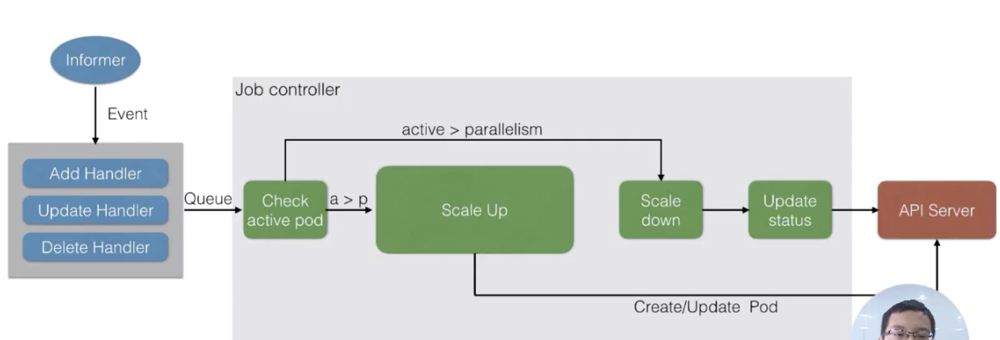
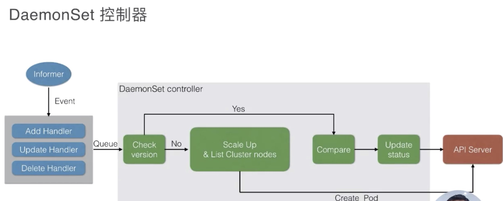

* [Lec7: 应用编排与管理-Job 和 Daemonset](#lec7-应用编排与管理-job-和-daemonset)
   * [1. Job](#1-job)
      * [1. 为什么需要 Job?](#1-为什么需要-job)
      * [2. Job Controller 可以做什么？](#2-job-controller-可以做什么)
      * [3. Job 参数](#3-job-参数)
   * [4. Job 中的定时任务 CronJob](#4-job-中的定时任务-cronjob)
      * [5. 控制器](#5-控制器)
   * [2. DaemonSet](#2-daemonset)
      * [1. 需求：](#1-需求)
      * [2. 场景：](#2-场景)
      * [3. 更新策略](#3-更新策略)
      * [4. 控制器](#4-控制器)

Created by [gh-md-toc](https://github.com/ekalinin/github-markdown-toc)

### Lec7: 应用编排与管理-Job 和 Daemonset

#### 1. Job

##### 1. 为什么需要 Job?

如果要 Pod 直接运行运行进程：

1. 如何保证 Pod 的进程正确的结束
2. 如果进程失败，如何处理
3. 如何管理多个任务并且任务间相互关联
4. 如何并行的运行任务并管理队列的大小

##### 2. Job Controller 可以做什么？

1. 可以创建一个或者多个 Pod, 并确定指定 pod 数量成功的运行
2. 监控 pod  的状态，根据配置及时的重试失败的 Pod
3. 确定依赖关系，保证上一个任务完成再进行下一个任务
4. 可以控制并行度，根据配置保证任务队列的大小

##### 3. Job 参数

Spec.template.spec.restartPolicy  指定任务失败后策略 例如：Never

Spec.backoffLimit 重启次数

Spec.completions 该 pod 队列执行次数

Spec.parallelism 并行执行个数

```bash
$ kubectl get job --watch
       # 完成状态     # 业务实际运行时间  # 现在时间-创建时间
NAME   COMPLETIONS   DURATION   AGE
pi     0/1           29s        29s
```

```yaml
$ kubectl get pod -o yaml
apiVersion: v1
items:
- apiVersion: v1
  kind: Pod
  metadata:
    creationTimestamp: "2019-07-02T14:26:13Z"
    generateName: pi-
    labels:
      controller-uid: 582fb201-9cd5-11e9-84b0-080027730c60
      job-name: pi
    name: pi-txzzr
    namespace: default
    ownerReferences: # 归 batch/v1 的控制器控制
    - apiVersion: batch/v1
      blockOwnerDeletion: true
      controller: true
      kind: Job
      name: pi
      uid: 582fb201-9cd5-11e9-84b0-080027730c60
    resourceVersion: "11948"
    selfLink: /api/v1/namespaces/default/pods/pi-txzzr
    uid: 5831412d-9cd5-11e9-84b0-080027730c60
```

#### 4. Job 中的定时任务 CronJob

Spec.scheduler 与 linux 中 crontab 时间格式相同： */1 * * * * 每一分钟

Spec.startingDeadlineSeconds Job最长启动时间

spec.concurrencyPolicy 是否并行执行

spec.successfulJobsHistoryLimit 允许留存历史 job 个数


##### 5. 控制器



Queue 是内存级的消息队列，图中的 a>p 应该是 a<p


#### 2. DaemonSet

##### 1. 需求：

1. 每一个节点运行相同的 pod
2. 新节点加入，如何感知性自动启动 Pod，如果移除 node感知性的删除 pod
3. Pod 状态异常，如何监控处理 pod

##### 2. 场景：

1. 部署存储进程 Ceph, glusterfs
2. 日志收集： flunted, logstash
3. Node-expoter 、nvidia-device-plugin、rdma-device-plugin

Node selector 确定部分节点运行 daemonset

##### 3. 更新策略

1. RollingUpdate ds配置更新会先删除 pod, 再创建新的 pod 可配合健康检查滚动升级
2. OnDelete ds模板更新后，手动删除 pod 后才会更新

```bash
kubectl rollout status ds/xxx
```

##### 4. 控制器



相对于 之前的控制器，回去额外监控 node 的状态
