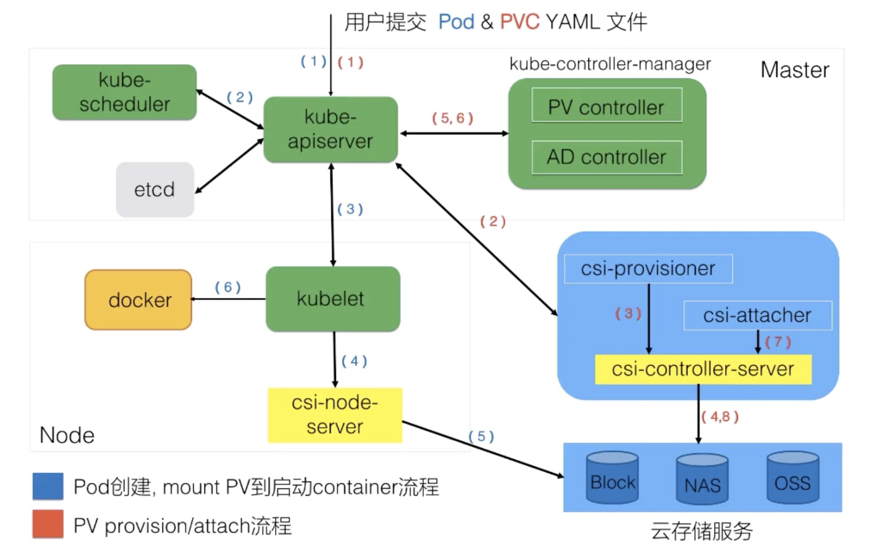
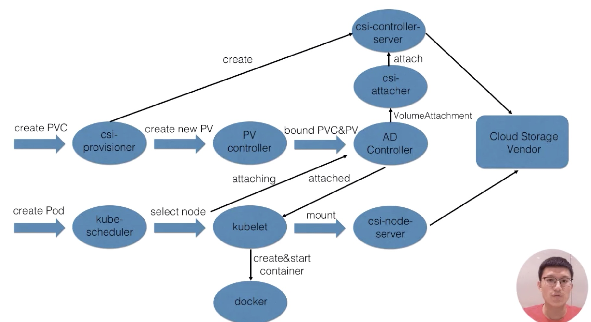

### Lec9: 应用存储和持久化数据卷：核心知识

#### 1. Pod Volumes

##### 1. 需求

1. 当 pod 异常退出，如何保证 kubelet 重新拉起的时候数据不会丢失
2. 同一个 pod 的容器如何共享存储

##### 2. 常见类型

1. 本地存储: emptyDir、hostPath
2. 网络存储
   1. In-tree(代码在 kubernetes 仓库中的) ：awsElasticBlockStore、gcePersistentDisk/nfs...
   2. out-tree : flexVolume、csi 等
3. Projected Volumes: secret/configmap/serviceaccountToken

##### 3. 如何使用

```yaml
apiVersion: v1
kind: Pod
metadata:
  name: busybox
spec:
  containers:
    image: busybox
    conmand: ["/bin/sh", "-c", "ls /etc/config"]
    restartPolicy: Never
    volumeMount:
      - name: secret-volume
        mountPath: /etc/secret
        readOnly: true
  volumes:
    - name: empty
      emptyDir: {} # 宿主机路径 /var/lib/kubelet/pods/<PodID>/volumes/kubernetes.io-empty-dir/cache-volumem 多容器挂载将会有多个临时文件，相对于 hostPath ，pod 删除也会被删除
    - name: secret-volume
      secret:
        secretName: mysecret
```


#### 2. Persistence Volumes

##### 1.. 常见场景

1. Pod 销毁重建（例如 deployment 的更新操作）
2. 宿主机故障迁移（statefulSet 已经实现了带卷迁移）
3. 多 Pod 共享同一个数据 volumes
4. 对 volumes 做功能性拓展，例如 snapshot、 resize 

我们发现 pod volumes无法满足上面的一些需求

如何将存储和计算分离，使用不同的组件（controller）管理存储和计算资源，解耦 pod 和 volume 生命周期关联。

#### 3. PersistenceVolumesClaim

##### 1. 需求

1. 职责分离：用户只需要关心，访问卷的大小，访问卷的权限（读写，单点、分布式），对 PV 进行管控；（类似面向对象的原理）
2. 通过 kube-controller-manager 的 PersistenceVolumesController 将 PVC 和 PV bind

##### 2. 种类

1. Static Volume Provisioning

   管理者预先设定集群存储使用情况，预分配一些 PV ，当 Pod 被提交后 k8s 将 PVC 和 PV进行绑定： 很难完全满足用户需求

2. Dynamic volume Provisioning

   管理员预先写模板文件 StorageClass , 用于提交 pod 指定 pvc 需求，后 k8s 将动态的读取 pvc 配置打到模板文件生成动态的 PV

##### 3. 如何使用

1. 静态：

   1. Admin 创建文件系统和挂载点，创建 PV 对象，设定文件大小，挂载点，访问模式等

      ```yaml
      apiVersion: v1
      kind: PersistenceVolume
      metadata:
      - name: nas-csi-pv
      spec:
        capacity:
          storage: 5Gi 
        accessModes:
        - ReadWriteMany #可以被多个node挂载并具备读写权限
        persistenceVolumeReclaimPolicy: Retain # 该 volume 使用后如何回收策略
        csi:
          driver: nasplugin.csi.alibabacloud.com
          volumeHandler: data-id
          volumeAttributes:
            host: "***.cn-beijing.nas.aliyuncs.com"
            path: "k8s"
            vers: "4.0"
      ```

      

   2. User：创建 PVC ，在 spec.containers[].volumeMount 中挂载

      ```yaml
      apiVersion: v1
      kind: PersistenceVolumeClaim
      metadata:
        name: nas-pvc
      spec:
        accessMode: ReadWriteMany
        resource:
          request:
            storage: 5Gi
      ___
      
      apiVersion: v1
      kind: Pod
      metadata:
        name: busybox
      spec:
        containers:
          image: busybox
          conmand: ["/bin/sh", "-c", "ls /etc/config"]
          restartPolicy: Never
          volumeMount:
            - name: nas-pvc
              mountPath: /data
        volumes:
          - name: nas-pvc
            persistenceVolumeClaim:
              claimName: nas-pvc
            
      ```

2. 动态 Provisioning

   1. 创建 StorageClass

      ```yaml
      apiVersion: storage.k8s.io/v1
      kind: StorageClass
      metadata:
        name: csi-disk
      provisioner: diskplugin.csi.alibabacloud.com
      parameters:
        regionId: cn-Beijing
        zoneId: cn-beijing-b
        fsType: ext4
        type: cloud_ssd
      reclaimPolicy: Delete
      ```

   2. 创建 PVC

      ```yaml
      apiVersion: v1
      kind: PersistenceVolumeClaim
      metadata:
        name: disk-pvc
      spec:
        accessMode: ReadWriteMany
        resource:
          request:
            storage: 5Gi
        storageClassName: csi-disk
      ```

   3. 创建 pod

      ```yaml
      apiVersion: v1
      kind: Pod
      metadata:
        name: busybox
      spec:
        containers:
          image: busybox
          conmand: ["/bin/sh", "-c", "ls /etc/config"]
          restartPolicy: Never
          volumeMount:
            - name: disk-pvc
              mountPath: /data
        volumes:
          - name: disk-pvc
            persistenceVolumeClaim:
              claimName: disk-pvc
      ```


##### 4. PV 字段

capacity：存储总空间

AccessMode: PV 的访问策略列表，只有和 PVC 一致才会绑定

-  ReadWriteOnce 只允许单 node 访问
- ReadOnlyMany 只读多 node 访问
- ReadWriteMany 多 node 读写访问

一个 PV 可以设置多个访问策略：PV controller 首先会找到 PVC 指定策略符合的 PV 匹配列表，然后从该集合中找到 Capacity 最小的符合 PVC size 的 PV 对象

PersistenceVolumeReclaimPolicy: PV  被 realease 后回收策略：

- Delete: 直接删除需要 volume plugin 支持
- Retain: 默认，由管理员手动回收

StorageClassName: PVC 通过该字段找到 PV （静态的 Provisioning）， 也可以通过该字段对应的 storageclass 从动态的 Provisioning 获取新的 PV 对象

NodeAffinity: 限制该 pv 可访问 node，（需要和调度结合）使用该 pv 的 pod 只能在该 node 上运行


##### 5. PV  创建流程

声明 PV 对象 -> pending  ->（真正创建好对象）avaliable -> (pvc 声明后) bound -> released -> delete 

**注意：**在 released 状态是无法回到 avaliable 在重新绑定的（根据 PersistenceVolumeReclaimPolicy），要想使用之前的 PV 的信息可以：

- 使用 old PV 的声明信息重新创建一个
- 直接从 PVC 复用，及不 unbound PV  和 PVC （即，statefulset 存储状态的原理）


#### 5 PV 和 PVC 架构   



csi-provisioner 和 csi-attach(customer storage interface)  是社区提供

云存储服务是厂商提供（根据 openapi 做 create delete mount 等操作）



